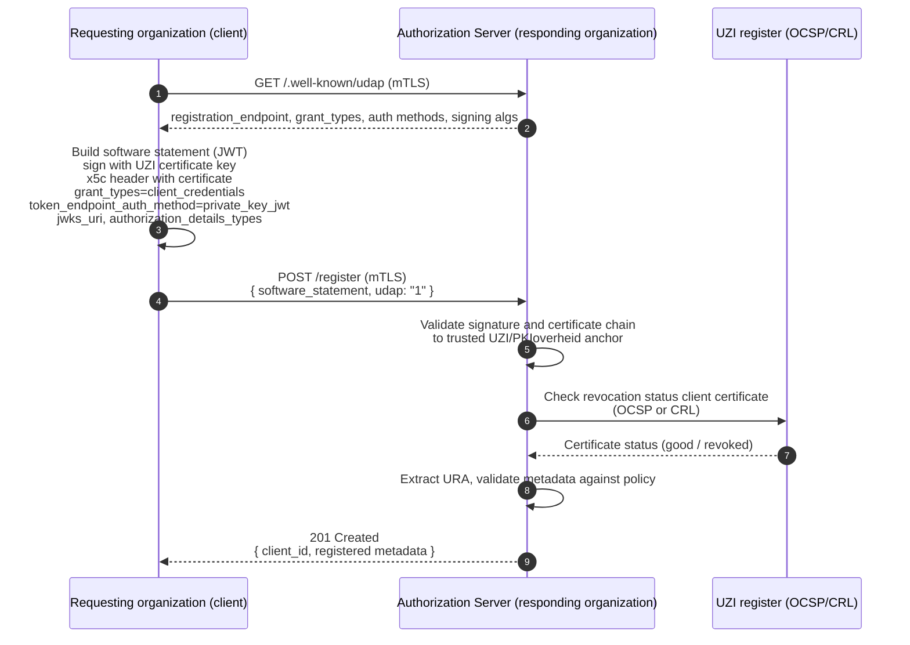
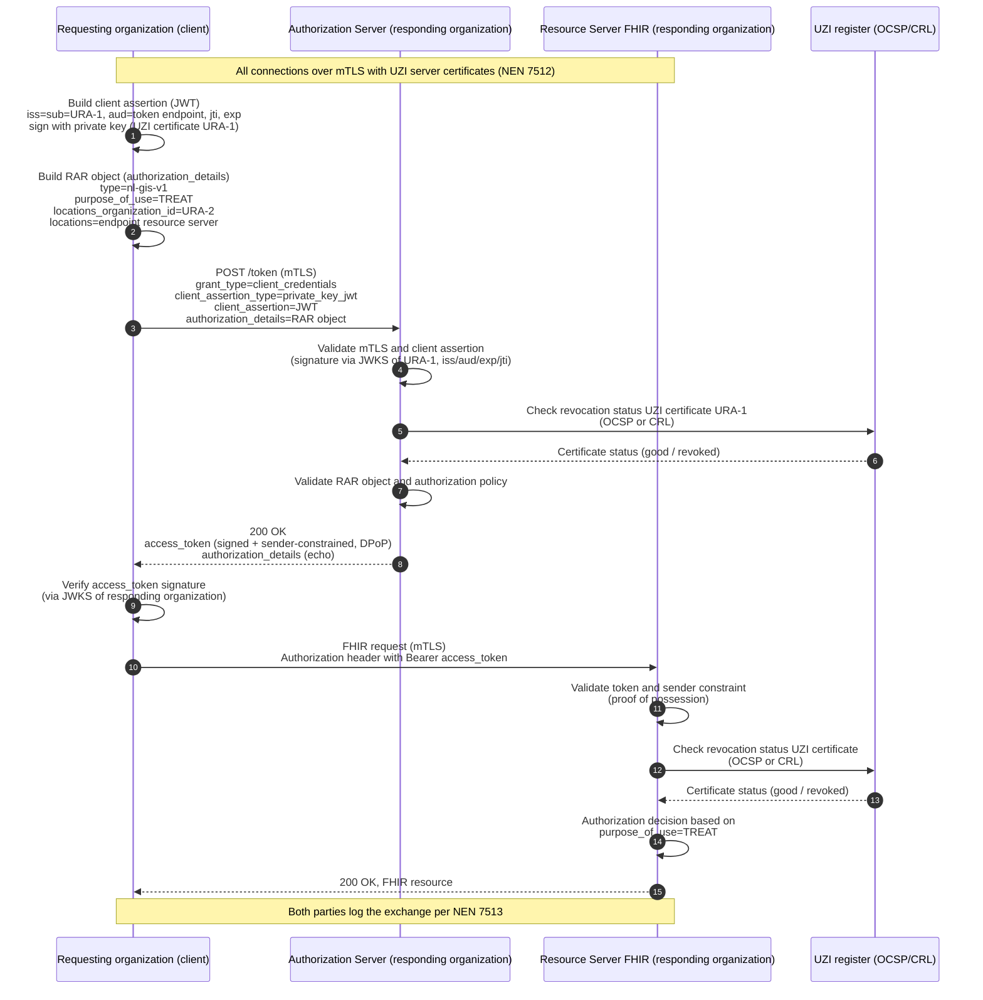

### Introduction

This FHIR Implementation Guide specifies the technical components of the Generic Function Authentication, a national initiative led by the Dutch Ministry of Health, Welfare and Sport (VWS). GF Authentication describes a harmonized approach to authentication and authorization for the healthcare data exchanges *Basisgegevensset Zorg* (BgZ) and *eOverdracht* (nursing handover), both mandatory under the Wegiz.

The goal is a single, interoperable method for reliably establishing the identity of the exchanging healthcare organizations (authentication) and determining what an established identity is allowed to do (authorization). Harmonization avoids the situation where healthcare providers must operate two comparable facilities and decide per exchange which method applies, which is more expensive and error-prone.

Key design principles include:

- **International standards**: the solution builds exclusively on open, internationally adopted standards (OAuth 2.0, FAPI 2.0, RAR), lowering the bar for European data exchange and adoption by internationally operating software vendors.
- **Federated trust**: each healthcare provider authenticates its own practitioners and systems within its own domain; across the organizational boundary only the organization identity is verified.
- **Organization-level identity**: the organization identity is anchored in the UZI register and carried as the URA number (`UZI-RegisterAbonneenummer`).
- **Stakeholder responsibility**: each healthcare provider, as an independent controller, is accountable for the authentication of its own practitioners and systems.

### Solution overview

At the organizational boundary, an exchange between two healthcare providers is authenticated at the *organization* level only. The requesting organization (client) proves its organization identity (URA) to the responding organization, states the purpose of the exchange, and receives an access token that grants access to the requested resources on the responding organization's FHIR resource server.

The solution is built on:

- **OAuth 2.0** as the de-facto international standard for controlled access between systems.
- The **OAuth FAPI 2.0** security profile, which mandates asymmetric client authentication (no shared secrets), sender-constrained access tokens, mandatory transport security, and strict token and request validation.
- The **client-credentials** grant, because the exchange is system-to-system: the practitioner is already authenticated within its own domain and no interactive user is present in the exchange.
- **`private_key_jwt`** for message-level organization authentication, decoupled from the transport certificate.
- A **Rich Authorization Requests (RAR, [RFC 9396](https://www.rfc-editor.org/rfc/rfc9396))** object to carry healthcare-specific attributes such as the purpose of use and the target organization/endpoint.

#### Scope

**In scope** is the targeted *sending* of health data between two healthcare providers within BgZ and eOverdracht, where a referral, handover or "aanmelding" precedes the exchange and a (starting) treatment relationship therefore exists at the receiving organization. In this situation consent is presumed: the patient's consent is already implied in the agreement to the referral.

**Out of scope** (addressed in [Authorization](./authorization.html) and future work) are authorization for other use cases such as a query without a preceding referral (no presumed consent) or exchanges that do not run between two healthcare providers (for example from a PGO or research institution). The query use case is previewed in [Outlook: the "query" use case](#outlook-the-query-use-case), because the chosen technique is well prepared for it.

### Federated trust model

The legal framework (WGBO, AVG and Wabvpz) leads to a **federated trust model**:

- Each healthcare provider is exclusively responsible for the authentication and authorization of its *own* practitioners and systems within its own domain. A provider does not re-do the authentication of the exchange partner and may rely on its statement.
- The source-holding healthcare provider *is* responsible for authenticating and authorizing the *other organization* it exchanges data with. Across the organizational boundary only the identity of the exchange partner (the other healthcare provider) is verified.
- For authorization of the exchange, the purpose or legal basis must also be known (for eOverdracht and BgZ the basis is: "necessary for the performance of the treatment agreement").

This trust is not without obligation: it is enforced through legally mandated standards (NEN 7510/7512/7513), admission requirements up front, audits and supervision on an ongoing basis, and logging and liability after the fact. The logging requirements (NEN 7513) and the patient's right of access (Wabvpz) mean it must be possible to determine afterwards which practitioner or which system at another healthcare provider requested data.

> The introduction of the Dezi system (after the Wet DIAZ enters into force) changes the *provider-internal* authentication of practitioners, but not the division of responsibility. The approach specified here is prepared for this and does not depend on it.

### Requirements for the technical implementation

From the legal framework the following requirements follow that the technology must fulfil:

1. **Mutual establishment of the healthcare provider identity.** Both parties reliably establish which organization they are exchanging with, based on the URA from the UZI register. This also applies when a hub or intermediary acts on behalf of one of the providers. This also limits the risk that, when sending data, it ends up with the wrong party — data may only be delivered to the established healthcare provider.
2. **No authentication of individual practitioners or systems of the partner.** Within the data exchange the technology does not need to verify at the person or system level; it only carries the context needed for authorization, logging and traceability at the organization level.
3. **Explicit carrying of the purpose of the exchange.** The purpose must be stated explicitly so that it can be distinguished from other (later to be supported) purposes/legal bases, and the source can base an authorization decision on it.

### Technical choices

| Choice | Rationale |
|--------|-----------|
| **OAuth 2.0** as the basis | De-facto international standard for controlled access between systems; prescribed by HL7 and IHE. |
| **FAPI 2.0** security measures | Proven, internationally supported security profile; asymmetric client authentication, sender-constrained tokens, strict validation. |
| **Client-credentials** flow | No interactive user in the exchange; system-to-system. |
| **`private_key_jwt`** client authentication | Independent of the transport certificate; message-level, signed statement of organization identity. Preferred by service providers and aligned with existing infrastructure (e.g. the Nuts node) that already publishes public keys via a web endpoint. |
| **Signed token request and access token** | Organization identity (URA) is cryptographically verifiable at every point in the chain. |
| **RAR object** for healthcare attributes | Generic and extensible carrier for `purpose_of_use`, target organization and endpoint; avoids a system-specific JWT extension. |

The transport layer remains secured with **mTLS**, initially based on UZI server certificates or PKIoverheid certificates (until the GIS Veilig Netwerk requires a different implementation). Organization authentication is deliberately decoupled from the transport certificate and secured at the message level, because a (Veilig Netwerk) transport certificate does not always uniquely identify the healthcare provider (it may be managed by a service provider).

### Client authentication with `private_key_jwt`

The requesting organization authenticates to the token endpoint with a signed JWT client assertion ([RFC 7523](https://www.rfc-editor.org/rfc/rfc7523)), as required by FAPI 2.0. The assertion is signed with the private key belonging to the organization's UZI certificate, and the responding organization validates the signature via the requesting organization's JWKS endpoint.

The client assertion JWT contains at least the following claims:

| Claim | Description |
|-------|-------------|
| `iss` | Issuer — the URA of the requesting organization. |
| `sub` | Subject — equal to `iss` (the client's own URA). |
| `aud` | Audience — the URL of the token endpoint of the responding organization. |
| `exp` | Expiration time (short-lived). |
| `jti` | Unique identifier of the assertion, to prevent replay. |

The token request is a standard `client_credentials` request that carries the assertion and the RAR object:

```
POST /token HTTP/1.1
Host: as.zorgaanbieder-b.nl
Content-Type: application/x-www-form-urlencoded

grant_type=client_credentials
&client_assertion_type=urn%3Aietf%3Aparams%3Aoauth%3Aclient-assertion-type%3Ajwt-bearer
&client_assertion=eyJhbGciOiJSUzI1NiIs...
&authorization_details=%5B%7B%22type%22%3A%22nl-gis-v1%22...%7D%5D
```

The issued access token is itself **signed** by the responding organization and **sender-constrained** (via `DPoP` or mTLS), so that possession of the token alone is not sufficient to use it.

### Rich Authorization Requests (RAR)

The client-credentials flow carries no healthcare-specific information by itself. FAPI 2.0 refers to Rich Authorization Requests ([RFC 9396](https://www.rfc-editor.org/rfc/rfc9396)) for this: the `authorization_details` parameter carries an extensible JSON structure with, per object, a `type` and type-specific fields.

The RAR object sent with the token request looks conceptually as follows:

```json
{
  "authorization_details": [
    {
      "type": "nl-gis-v1",
      "purpose_of_use": "http://terminology.hl7.org/CodeSystem/v3-ActReason|TREAT",
      "locations_organization_id": "urn:oid:2.16.528.1.1007.3.3.12345678",
      "locations": ["https://fhir.zorgaanbieder-b.nl/fhir"]
    }
  ]
}
```

| Field | Description |
|-------|-------------|
| `type` | Identifies the RAR object type for this ecosystem (`nl-gis-v1`). |
| `purpose_of_use` | The legal basis / purpose of the exchange. For BgZ and eOverdracht this is `TREAT` from the [HL7 v3 ActReason](http://terminology.hl7.org/CodeSystem/v3-ActReason) code system. |
| `locations_organization_id` | The URA of the responding organization whose data is requested. |
| `locations` | The resource server(s) for which access is requested (a RAR-standard field). |

Other purposes or legal bases than "treatment" can be implemented with the same authorization protocol by giving `purpose_of_use` a different value (for example emergency/vital interest, a query from the citizen/PGO, or a query for scientific research). Each purpose has its own legal-basis and consent requirements.

### Dynamic Client Registration

In a federated, many-to-many healthcare network it does not scale to configure every requesting organization manually at every responding organization's authorization server. This chapter specifies how a requesting organization registers itself as an OAuth client at a responding organization's authorization server **automatically and trust-based**, using its existing UZI/PKIoverheid certificate as the root of trust.

Registration follows the OAuth 2.0 Dynamic Client Registration Protocol ([RFC 7591](https://www.rfc-editor.org/rfc/rfc7591)), profiled along the lines of the HL7 [UDAP](https://www.udap.org/) Security profile so that trust is established from an X.509 certificate rather than from an out-of-band shared secret. This reuses the same certificate infrastructure (UZI/PKIoverheid) and the same organization identity (URA) as the token exchange, and produces a client that is configured for the `client_credentials` grant with `private_key_jwt` authentication.

#### Discovery

Before registering, the client discovers the authorization server's registration endpoint and capabilities from the server's metadata ([RFC 8414](https://www.rfc-editor.org/rfc/rfc8414)) and/or the UDAP well-known endpoint:

```
GET /.well-known/udap HTTP/1.1
Host: as.zorgaanbieder-b.nl
```

The response advertises at least the `registration_endpoint`, the supported grant types (`client_credentials`), the supported token endpoint authentication methods (`private_key_jwt`), and the supported signing algorithms.

#### Software statement

The registration request is authenticated with a **software statement**: a signed JWT that conveys the requested client metadata. The software statement is signed with the private key corresponding to the requesting organization's UZI (or PKIoverheid) certificate. The certificate itself is included in the JWT header (`x5c`), so the authorization server can validate the signature and the certificate chain up to a trusted UZI/PKIoverheid trust anchor and extract the URA.

The software statement JWT payload contains at least:

| Claim | Description |
|-------|-------------|
| `iss` | The client identifier from the certificate (organization URI/URA). |
| `sub` | Equal to `iss`. |
| `aud` | The registration endpoint URL of the responding organization. |
| `iat` / `exp` | Issued-at and (short) expiration time. |
| `jti` | Unique identifier, to prevent replay. |
| `client_name` | Human-readable name of the client software/organization. |
| `grant_types` | `["client_credentials"]`. |
| `token_endpoint_auth_method` | `"private_key_jwt"`. |
| `scope` | The requested scopes (for example `system/*.read`). |
| `jwks_uri` (or `jwks`) | The endpoint (or inline key set) publishing the client's public keys used for `private_key_jwt` and access-token validation. |
| `authorization_details_types` | The RAR object types the client will use, e.g. `["nl-gis-v1"]`. |

#### Registration request

The client sends the software statement to the registration endpoint over **mTLS**. The request body follows RFC 7591 / UDAP:

```
POST /register HTTP/1.1
Host: as.zorgaanbieder-b.nl
Content-Type: application/json
```

```json
{
  "software_statement": "eyJhbGciOiJSUzI1NiIsIng1YyI6WyIuLi4iXX0...",
  "udap": "1"
}
```

#### Validation by the authorization server

Upon receiving the registration request, the authorization server:

1. Validates the software statement signature and the `x5c` certificate chain up to a trusted UZI/PKIoverheid trust anchor.
2. Checks the revocation status of the client certificate (OCSP or CRL) at the UZI register.
3. Extracts and records the organization identity (URA) from the certificate.
4. Verifies that the requested metadata is acceptable under local policy (grant types, auth method, scopes, `authorization_details_types`).
5. Registers the client and returns a `client_id`.

Because the client identity is bound to the certificate, no separate credential is issued or exchanged: subsequent token requests authenticate with `private_key_jwt` using the same key material.

#### Registration response

On success the authorization server responds with `201 Created` and the registered client metadata ([RFC 7591](https://www.rfc-editor.org/rfc/rfc7591)):

```json
{
  "client_id": "b8e7f3c2-1a4d-4e6f-9c2b-7d5a1e0f3b2c",
  "software_statement": "eyJhbGciOiJSUzI1NiIsIng1YyI6WyIuLi4iXX0...",
  "grant_types": ["client_credentials"],
  "token_endpoint_auth_method": "private_key_jwt",
  "scope": "system/*.read",
  "jwks_uri": "https://zorgaanbieder-a.nl/.well-known/jwks.json",
  "authorization_details_types": ["nl-gis-v1"]
}
```

#### Registration flow



> **Manual registration** remains possible as an alternative where dynamic registration is not (yet) supported; in that case the same metadata (URA, `jwks_uri`, grant type, auth method) is configured out of band.

### Example flow

The complete token exchange, following dynamic (or manual) registration, runs as follows:



Both the client assertion in the token request and the access token are signed with the key belonging to the UZI certificate of the issuing organization; the receiver validates the signature via that organization's JWKS endpoint. Only the organization identity (URA) is cryptographically verifiable; the purpose (and, for a query, the organization type) travels as a statement of the requesting organization, which is responsible and liable for it.


### Conclusion

The BgZ and eOverdracht exchanges are harmonized on the basis of a single federated trust model. Each healthcare provider authenticates its own practitioners and systems within its own domain; across the organizational boundary only the organization identity (URA) is verified, via signed tokens and a connection secured for now with UZI server certificates or PKIoverheid certificates. The technical implementation relies entirely on existing international standards (OAuth 2.0, FAPI 2.0, RAR) and is prepared for extension to other use cases.
