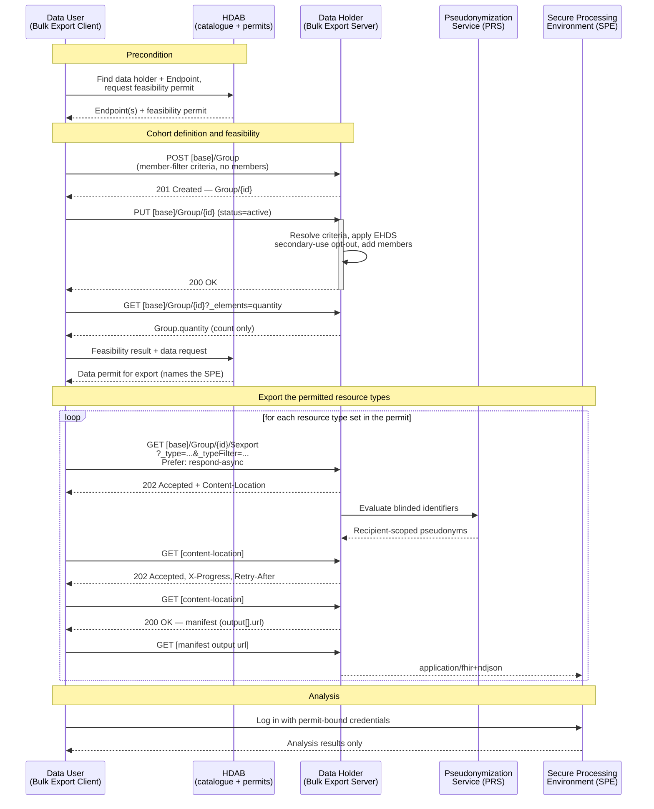

Generic Function Bulk Export defines how a data user (for example a researcher or a public health body) obtains health data from one or more data holders (health care providers) for **secondary use**, without those data holders having to build a bespoke extraction pipeline per research project. It covers the path from a feasibility count on a not-yet-known cohort, through a permitted export, to the delivery of de-identified NDJSON files inside a Secure Processing Environment (SPE).
{: .ig-lead}

Use this guide when **all** of the following apply:

- The purpose is secondary use (research, innovation, policy making, statistics, regulatory activities) and not the provision of care to the individual. 
- In this guide, it is assumed the data user needs **many subjects at once**: the result set is a population, not one patient's record.
- The data holder already exposes its data as FHIR resources (e.g. for primary use), or can project them onto FHIR resources, using the European profile stack (see [Data scope](#data-scope)).

The following preconditions SHALL be met before any transaction on this page is executed:

1. The data holder is registered in the **HDAB catalogue** (the national dataset catalogue of the Health Data Access Body), including a FHIR `Endpoint` for its Bulk Export Server. For the discovery of that endpoint, [GF Addressing](./care-services.html) MAY be used.
2. The data user holds a **data permit** issued by the HDAB (or another governing body) that covers, at minimum, the feasibility phase: establishing *how many* research subjects a data holder can contribute. A second, broader permit is required before data can be exported to the Secured Processing Environment.
3. The data holder is able to evaluate the **EHDS secondary-use opt-out** for its patients. Subjects who have opted out are excluded at the moment the research-subjects group is activated.
4. A **Secure Processing Environment** is designated in the data permit, and the data user is authorised to log in to it. 

This guide does not define the legal framework (data permits, data use agreements, ethical review), the cohort science, or the analysis performed inside the SPE. It defines the technical interface between data user and data holder.

### Solution overview

GF Bulk Export is based on the HL7 [FHIR Bulk Data Access (Flat FHIR) IG, STU3](https://hl7.org/fhir/uv/bulkdata/STU3/en). All exchanges are the standard asynchronous request pattern: a kick-off request that returns `202 Accepted` with a `Content-Location`, a polling location that returns a JSON manifest when the job is complete, and NDJSON output files referenced from that manifest. This guide adds national choices; it does not redefine the operation.

Two elements are layered on top of the Bulk Data IG:

- **What may be asked for.** The exportable resource types and the search parameters usable in `_type` and `_typeFilter` are bounded by the EHDS priority data categories for primary use and their European FHIR profiles ([HL7 Europe Base and Core](https://build.fhir.org/ig/hl7-eu/base/), [HL7 Europe Laboratory Report](https://build.fhir.org/ig/hl7-eu/laboratory/), [HL7 Europe Imaging Report](https://build.fhir.org/ig/hl7-eu/imaging-r5/en/)). Where a resource type is covered by an IHE [QEDm](https://profiles.ihe.net/PCC/QEDm/) named option, its [PCC-44](https://profiles.ihe.net/PCC/QEDm/PCC-44.html) search parameter combinations are reused, so a data holder that already implements QEDm for primary use needs no second query surface.
- **Who may ask for it, and where the answer lands.** The data permit is the authorisation artefact, pseudonymisation is delegated to the national [Pseudonymization Service](./pseudonymisation.html), and output files are written to the SPE named in the permit.


#### Process

The data user first establishes whether a cohort is large enough to be worth a permit (feasibility), and only then requests the data itself. The research-subjects group is the shared handle between these two phases: it is created once, by criteria, and reused by every subsequent export.

1. **Precondition.** The data user finds the data holder and its Bulk Export Server `Endpoint` in the HDAB catalogue, defines the characteristics of the research subjects (the patient cohort) and the characteristics of the data needed, and holds a data permit for the feasibility phase.
1. **Create the research-subjects group.** The data user creates a `Group` at each data holder that carries the cohort *criteria* and no members.
1. **Activate the group.** The data holder resolves the criteria against its own population, applies the EHDS secondary-use opt-out, and adds the eligible subjects as members.
1. **Read the count and assess feasibility.** The data user reads `Group.quantity`. No member identities are returned in this phase.
1. **Obtain the export permit.** With the counts from all data holders, the data user applies at the HDAB for a data permit covering the actual export, naming the SPE.
1. **Export per resource type.** For each resource type in the permit, the data user kicks off `Group/{id}/$export` with `_type` and `_typeFilter`, polls the status location, and retrieves the manifest.
1. **Deliver into the SPE.** The NDJSON output is written to the SPE bound to the data permit. Direct identifiers are replaced by pseudonyms produced by the [Pseudonymization Service](./pseudonymisation.html) before the files become readable in the SPE.
1. **Analyse.** The data user logs in to the SPE and processes the data there. Data does not leave the SPE; only results do, subject to the permit's output checking.



### Data scope

The EHDS Regulation uses two different notions of "category", and this guide keeps them apart:

- **Secondary-use data categories** ([Regulation (EU) 2025/327](https://eur-lex.europa.eu/eli/reg/2025/327/oj), Article 51). These are the legal categories of electronic health data that a data permit may cover. Nearly everything exported through this guide falls in *electronic health data from EHRs* (Article 51(1)(a)); dispensing data also falls in *healthcare-related administrative data, including dispensation, claims and reimbursement data* (Article 51(1)(e)). An Article 51 category says nothing about structure and is not something a client can request over the wire.
- **Priority data categories for primary use** (Article 14 and Annex I): patient summaries, electronic prescriptions and dispensations, medical imaging studies and reports, medical test results, and discharge reports. These do have an agreed European FHIR representation, so this guide uses them to organise the exportable resource types and search parameters.

A data permit therefore states both: the Article 51 category as its legal scope, and the FHIR resource types with their `_typeFilter` criteria as its technical scope. Only the latter appears in a request.

A data holder claiming conformance to this guide SHALL support export of the resource types for at least one priority data category, and SHALL declare the supported types and the search parameters usable in `_typeFilter` in its `CapabilityStatement`, as required by the Bulk Data IG.

| Priority data category (Annex I) | FHIR resource types | Profiles | Search parameters usable in `_typeFilter` |
| --- | --- | --- | --- |
| Patient summary (EPS) | `Patient`, `Condition`, `AllergyIntolerance`, `MedicationStatement`, `Immunization`, `Procedure` | HL7 EU Core | `Patient`: `gender`, `birthdate`, `address-country`<br/>`Condition`: `category`, `code`, `clinical-status`, `onset-date`, `recorded-date`<br/>`AllergyIntolerance`: `code`, `clinical-status`, `date`<br/>`MedicationStatement`: `code`, `status`, `effective`<br/>`Immunization`: `vaccine-code`, `status`, `date`<br/>`Procedure`: `code`, `status`, `date` |
| ePrescriptions and eDispensations | `MedicationRequest`, `MedicationDispense`, `Medication` | HL7 EU Core | `MedicationRequest`: `code`, `status`, `intent`, `authoredon`<br/>`MedicationDispense`: `code`, `status`, `whenhandedover`<br/>`Medication`: `code` (no patient context; exported as a referenced resource) |
| Medical test results (laboratory) | `Observation`, `DiagnosticReport`, `Specimen`, `ServiceRequest` | HL7 EU Laboratory Report | `Observation`: `category`, `code`, `status`, `date`, `value-quantity`<br/>`DiagnosticReport`: `category`, `code`, `status`, `date`<br/>`Specimen`: `type`, `collected`<br/>`ServiceRequest`: `code`, `status`, `authored` |
| Medical imaging studies and reports | `ImagingStudy`, `ImagingSelection`, `DiagnosticReport`, `DocumentReference`, `Procedure`, `ServiceRequest` | HL7 EU Imaging Report | `ImagingStudy`: `modality`, `bodysite`, `started`, `status`<br/>`DiagnosticReport`: `category`, `code`, `status`, `date`<br/>`DocumentReference`: `type`, `category`, `date` |
| Discharge reports and encounter context | `Encounter`, `Composition`, `DocumentReference` | HL7 EU Core | `Encounter`: `class`, `type`, `status`, `date`<br/>`Composition`: `type`, `category`, `status`, `date`<br/>`DocumentReference`: `type`, `category`, `date` |
| Provenance (all of the above) | `Provenance` | IHE mXDE / QEDm Provenance Option | `target`, `recorded` |

National choices on this scope:

1. **QEDm reuse, not QEDm transport.** The `patient + category [+ code] [+ date]` combinations from QEDm [PCC-44] are the baseline for `_typeFilter` expressions on `Observation`, `DiagnosticReport`, `Condition`, `Procedure` and `Encounter`. The patient dimension comes from the group, so a `_typeFilter` expression SHALL NOT repeat a `patient` or `subject` criterion.
2. **`Provenance` travels with the data.** Unless the permit excludes it, `Provenance` resources whose `target` is an exported resource SHALL be included, so the data user can attribute a data element to its source document (including translation/transcoding).


### Components (actors)

#### Bulk Export Client

The Bulk Export Client acts on behalf of the data user. It:

- SHALL include `Prefer: respond-async` on kick-off and SHALL poll the `Content-Location` using exponential backoff, honouring `Retry-After`;
- SHALL be robust to a server that rejects an unsupported `_typeFilter` expression with an `OperationOutcome`, and SHALL NOT retry the same expression;
- SHOULD send `Accept-Encoding: gzip` when retrieving output files.

#### Bulk Export Server

The Bulk Export Server is operated by, or on behalf of, the data holder. It:

- SHALL implement `POST [base]/Group`, the `Group` read, and `GET [base]/Group/{id}/$export` per the Bulk Data IG;
- SHALL resolve group criteria against its own population and SHALL exclude subjects who have exercised the EHDS secondary-use opt-out at the moment the group is activated;
- SHALL declare the supported export resource types in `CapabilityStatement.rest.resource` and the `_typeFilter`-usable search parameters in `rest.resource.searchParam`;
- SHALL reject unsupported kick-off parameters and unsupported `_typeFilter` expressions with a `4XX` and a FHIR `OperationOutcome`, rather than silently ignoring them;
- SHALL limit the exported data to what the presented data permit covers, both in resource types and in subjects;
- SHALL group with the [Pseudonymization Service](./pseudonymisation.html) so that no direct identifier reaches the SPE;
- SHALL record an `AuditEvent` for each kick-off, status and output-file request;
- SHOULD support `DELETE [content-location]` so a client can cancel a job or signal that retrieval is finished.

#### Pseudonymization Service (PRS)

The national Pseudonymization Service produces pseudonyms from patient identifiers using HKDF and an OPRF, as specified in [GF Pseudonymisation](./pseudonymisation.html).

#### Secure Processing Environment (SPE)

The SPE is the environment designated in the data permit in which exported data may be processed. 

### Transactions

All transactions are secured as described in [Security](#security). `[base]` is the Bulk Export Server base URL obtained from the HDAB catalogue.

#### Create the research-subjects group

The client creates a `Group` that declares the [Bulk Cohort Group](https://hl7.org/fhir/uv/bulkdata/STU3/en/group.html) profile. Each criterion is one `member-filter` modifier extension holding a single resource-scoped FHIR query. Criteria within one expression are ANDed; separate `member-filter` extensions are intersected.

```
POST [base]/Group HTTP/1.1
Content-Type: application/fhir+json
Authorization: Bearer <access-token-bound-to-data-permit>

{
  "resourceType": "Group",
  "meta": { "profile": ["http://hl7.org/fhir/uv/bulkdata/StructureDefinition/bulk-cohort-group"] },
  "modifierExtension": [
    {
      "url": "http://hl7.org/fhir/uv/bulkdata/StructureDefinition/member-filter",
      "valueExpression": {
        "language": "application/x-fhir-query",
        "expression": "Condition?code=http://snomed.info/sct|34000006&clinical-status=active"
      }
    },
    {
      "url": "http://hl7.org/fhir/uv/bulkdata/StructureDefinition/member-filter",
      "valueExpression": {
        "language": "application/x-fhir-query",
        "expression": "Patient?birthdate=ge1980-01-01"
      }
    }
  ],
  "identifier": [
    { "system": "http://hdab.eu/NamingSystem/hdab-data-permit", "value": "PERMIT-2026-0142" }
  ],
  "type": "person",
  "actual": false,
  "status": "draft",
  "name": "IBD cohort, permit PERMIT-2026-0142"
}
```


#### Activate the group

After Group creation by the Bulk Export client, the Bulk Export Server starts (asynchronously) to turn group criteria into group members. This process is called 'group activation'.  
On activation the server SHALL evaluate the `member-filter` expressions against its own population, SHALL remove every subject with a registered EHDS secondary-use opt-out, and SHALL populate `Group.member`, `Group.quantity`, `Group.members-refreshed` and set `Group.actual` to `true`. 

Group membership is a snapshot. Refreshing the members of an existing group re-evaluates the criteria, including the opt-out register, and MAY change `quantity`. Bulk Export clients MAY trigger a member refresh by updating a Group and setting `actual` to `false`.

#### Read the research-subjects count

Activation may take some time; clients SHALL use exponential backoff and honour `Retry-After`. Under a feasibility-only permit the client SHALL use `_elements` to request every root element of `Group` except `member` and `contained`. That yields the cohort size (`quantity`), whether the group is activated (`actual`) and when its membership was last computed (the `members-refreshed` extension).

```
GET [base]/Group/{id}?_elements=id,meta,implicitRules,language,text,extension,modifierExtension,identifier,active,type,actual,code,name,quantity,managingEntity,characteristic HTTP/1.1
Accept: application/fhir+json
```

`members-refreshed` is an extension rather than a root element of `Group`, so it is requested through `extension`. The server marks the reduced resource with the `SUBSETTED` tag in `meta.tag`.

The response SHALL NOT carry `Group.member`; under a feasibility-only permit a read that requests member detail SHALL be refused with `403 Forbidden` and an `OperationOutcome`. If the permit sets a cohort threshold and `Group.quantity` is below it, the server SHALL NOT return `Group.quantity`. This limits re-identification through repeated narrow queries.

#### Kick off the export

One kick-off per FHIR resource type. `_type` names the resource type; `_typeFilter` narrows it.

```
GET [base]/Group/{id}/$export?
  _type=Observation
  &_typeFilter=Observation%3Fcategory%3Dlaboratory%26date%3Dge2024-01-01 HTTP/1.1
Accept: application/fhir+json
Prefer: respond-async
Authorization: Bearer <access-token-bound-to-data-permit>
```

Rules for this guide:

- `_type` SHALL be supplied. An omitted `_type` would export everything the token authorises, which is never what a data permit grants.
- Repeated `_typeFilter` expressions for the same resource type are ORed, as in the Bulk Data IG. A `_typeFilter` expression does not select patients — the group does.
- `_typeFilter` SHALL NOT contain search result parameters (`_sort`, `_include`, `_elements`, `_summary`), and SHALL have the search context of a single resource type.
- `_elements` SHOULD be used to request only the fields the research question needs. Output resources that were reduced carry the `SUBSETTED` tag in `meta.tag`.
- `_since` and `_until` filter on `meta.lastUpdated`, which is a record-keeping date. Clinical time windows SHALL be expressed with `_typeFilter` on the resource's own date parameter. Both parameters are available only when the data permit disables date shifting, see [Default date-shift policy](#default-date-shift-policy).

The response is `202 Accepted` with an absolute `Content-Location`.

#### Poll the status and read the manifest

```
GET [content-location] HTTP/1.1
Accept: application/json
```

While the job runs the server returns `202 Accepted`, optionally with `X-Progress` and `Retry-After`. On completion it returns `200 OK`, an `Expires` header, and the output manifest:

```json
{
  "transactionTime": "2026-03-04T09:00:00Z",
  "request": "https://fhir.dataholder.nl/Group/{id}/$export?_type=Observation",
  "requiresAccessToken": true,
  "output": [
    { "type": "Observation", "url": "https://spe.example.nl/permit-2026-0142/observation_1.ndjson", "count": 184233 }
  ],
  "error": []
}
```

A partial success is reported as `200 OK` with one or more `OperationOutcome` NDJSON files in `error`. A failed job is reported as `5XX` with an `OperationOutcome`.


### Security

#### Authentication

Organisation- and system-level authentication follows [GF Authentication](./authentication.html): OAuth 2.0 with the FAPI 2.0 security profile, `private_key_jwt` client authentication, sender-constrained access tokens, and mTLS transport. Because secondary use is attributable to a *named researcher* and not only to an organisation, the Bulk Export Client SHALL additionally establish the identity of that natural person through the **VAD** (*Vertrouwde AuthenticatieDienst*) over OpenID Connect, in the pattern implemented by the [MGO DVP Proxy](https://github.com/minvws/nl-mgo-dvp-proxy). That subject identity SHALL be carried into the token request and recorded in the `AuditEvent` of every transaction on this page.

#### Authorization

Authorization for bulk export is **not** based on a treatment relationship or on patient consent — neither exists here. The **HDAB data permit** is the authorisation artefact; see [Assumed data permit contents](#assumed-data-permit-contents) for what this guide expects it to carry.

- The data permit identifier SHALL be carried in the access token (as an `authorization_details` object, per [GF Authorization](./authorization.html)) and in `Group.identifier`. A server SHALL refuse an `$export` whose group was created under a different permit.
- A feasibility permit authorises group creation, update and the `quantity` read only. An `$export` presented under a feasibility permit SHALL be refused with `403 Forbidden`.
- The server SHALL refuse resource types and `_typeFilter` criteria outside the ones the permit lists, rather than silently trimming the result set.
- `requiresAccessToken` SHOULD be `true`; output file URLs are not capability URLs in this ecosystem.

#### Assumed data permit contents

This guide does not define data permits; that is the HDAB's domain. It does assume that the items below are derivable from a permit, because each of them drives a transaction or a control on this page. A permit that leaves an item open forces the data holder to fall back on the most restrictive interpretation.

| Element | Assumed content | Where it is used |
| --- | --- | --- |
| Permit identifier | A single identifier for the permit, in a  naming system such as `http://hdab.eu/NamingSystem/hdab-data-permit` | Carried in `Group.identifier` and in the access token; binds a cohort to the permit it was resolved under |
| Phase | Feasibility, or export | A feasibility permit allows group create, update and the count read; only an export permit allows `$export` |
| Purpose of use | The secondary-use purpose the HDAB granted | Carried in the `authorization_details` object, per [GF Authorization](./authorization.html) |
| Data user organisation | The organisation whose Bulk Export Client connects | The `private_key_jwt` client identity, per [GF Authentication](./authentication.html) |
| Named researcher(s) | The natural persons who may act under the permit | Established through the VAD and recorded in the `AuditEvent` of every transaction |
| Data holder(s) | The data holders the permit covers | The client creates one `Group` per listed data holder |
| Cohort criteria | The permitted research-subject characteristics | Expressed as `member-filter` expressions; the server refuses criteria outside them |
| Minimum cohort size | The disclosure threshold below which a cohort is too small to release | The server withholds `Group.quantity` below it and refuses the corresponding export |
| EHDS data categories | The Article 51 secondary-use categories the permit covers, typically *electronic health data from EHRs* (Article 51(1)(a)) | Legal scope of the permit; it is not requestable and does not by itself determine `_type` |
| FHIR resource types, filters and element constraints | The resource types, the `_typeFilter` criteria per type, and the elements the permit allows | Bounds `_type`, `_typeFilter` and `_elements`; the server refuses anything outside them |
| Date-shift setting | Default shifting, or a narrowed or disabled shift with the exempt resource types and elements named | Governs the [default date-shift policy](#default-date-shift-policy) and whether `_since` and `_until` are accepted |
| `Provenance` inclusion | Whether source attribution travels with the data | `Provenance` is exported unless the permit excludes it |
| Secure Processing Environment | The one environment the output may be delivered to | Destination of the NDJSON files, and the recipient scope for the [Pseudonymization Service](./pseudonymisation.html) |
| Validity and retention period | How long the permit is valid and how long the exported dataset may be held | Bounds the lifetime of the group and the dataset in the SPE |

#### Opt-out

The EHDS secondary-use opt-out is applied **by the data holder, at group activation**, and again at every re-activation. It is not a client-side filter and it is not visible to the data user: an opted-out subject is simply absent from `Group.member` and therefore from `quantity` and from every export of that group. A data holder that cannot reliably evaluate the opt-out register SHALL NOT activate the group.

#### Pseudonymisation and disclosure risk

Direct identifiers SHALL be replaced by pseudonyms produced by the [Pseudonymization Service](./pseudonymisation.html) before data becomes readable in the SPE, with the SPE of the data permit as the pseudonym recipient. Because pseudonyms are recipient-scoped, datasets from two permits cannot be joined, while records for the same subject delivered by different data holders under one permit can.

Pseudonymisation alone does not make a dataset anonymous. Indirect identifiers (rare diagnosis codes, exact dates, postal areas, extreme values) remain re-identifying. Suppressing them is a joint responsibility of the data permit (which SHOULD constrain `_elements`), the data holder (which SHOULD refuse exports below a minimum cohort size and applies the [default date-shift policy](#default-date-shift-policy)), and the SPE (which performs output checking).

#### Default date-shift policy

Exact dates are among the strongest indirect identifiers in an exported dataset. Unless the data permit specifies otherwise, the Bulk Export Server SHALL apply the following default date-shift policy to every exported resource:

- clinical `date` and `dateTime` values are moved by a deterministic, subject-specific offset in the range −15 through +15 days;
- the offset is constant per subject and per data permit, so intervals within one subject's record are preserved, records for one subject from different data holders under one permit stay aligned, and datasets from two permits do not;
- time-of-day is preserved; only the calendar date moves;
- `meta.lastUpdated` is shifted with the same offset; leaving a record-keeping timestamp unshifted next to a shifted clinical date would reveal the offset.

Because the exported `meta.lastUpdated` no longer matches the value the server selects on, `_since` and `_until` SHALL NOT be used while shifting is in effect; a kick-off request that supplies either SHALL be refused with a `4XX` and an `OperationOutcome`.

Cohort criteria and `_typeFilter` expressions are evaluated against the source dates, before the shift. An exported date may therefore fall just outside the clinical time window that selected the resource. A data user working with a narrow window SHALL widen it by the shift range or obtain a permit that disables shifting.

A data permit MAY disable or narrow date shifting where the research question requires exact dates, for example outbreak or seasonality research. The permit then names the resource types and elements that are exempt, and that exemption is carried in the access token like every other permit constraint. Only when the permit disables shifting altogether does `meta.lastUpdated` carry its source value and does the server accept `_since` and `_until`.

#### Transport and auditing

All exchanges SHALL use TLS 1.2 or later. Both the Bulk Export Client and the Bulk Export Server SHALL record `AuditEvent` resources following the [BALP](https://profiles.ihe.net/ITI/BALP/index.html) patterns, for kick-off, status and export requests, including the data permit identifier and the VAD-established researcher identity.