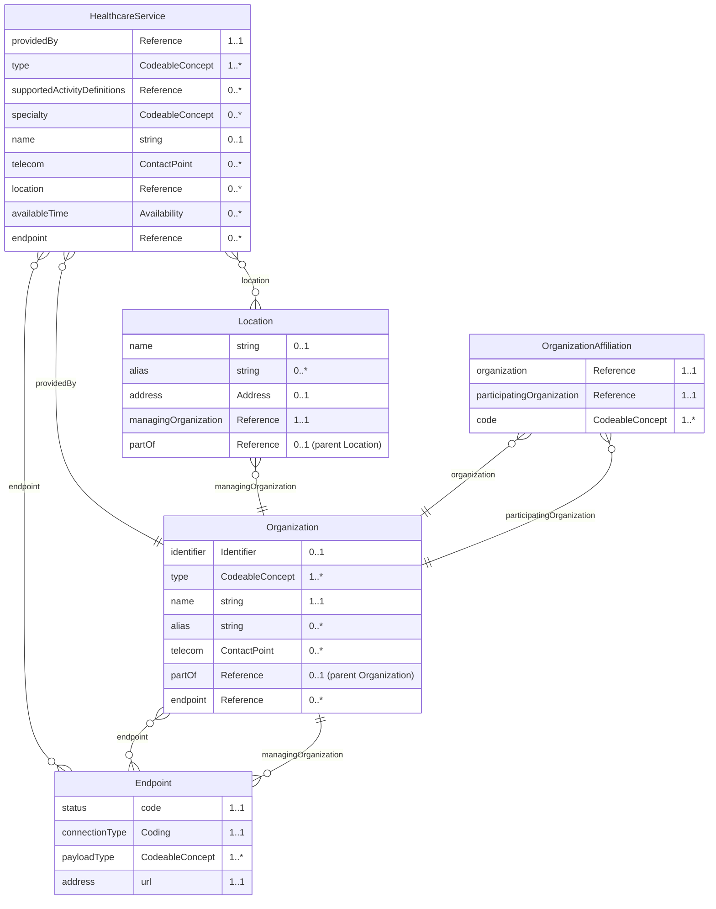
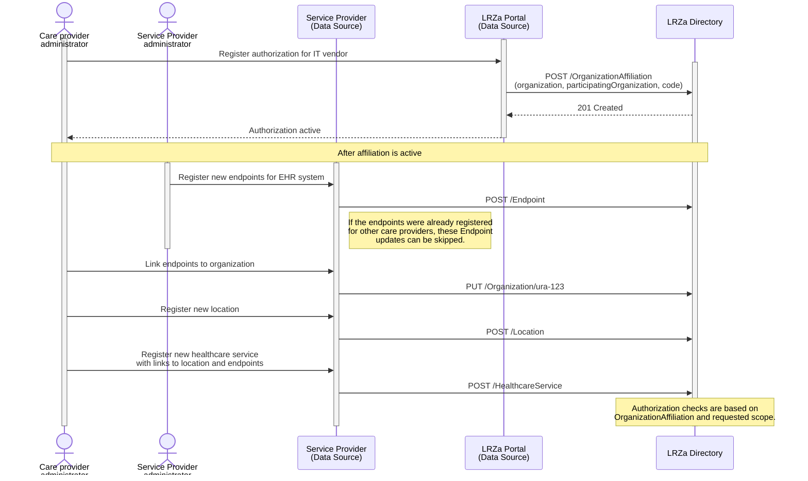
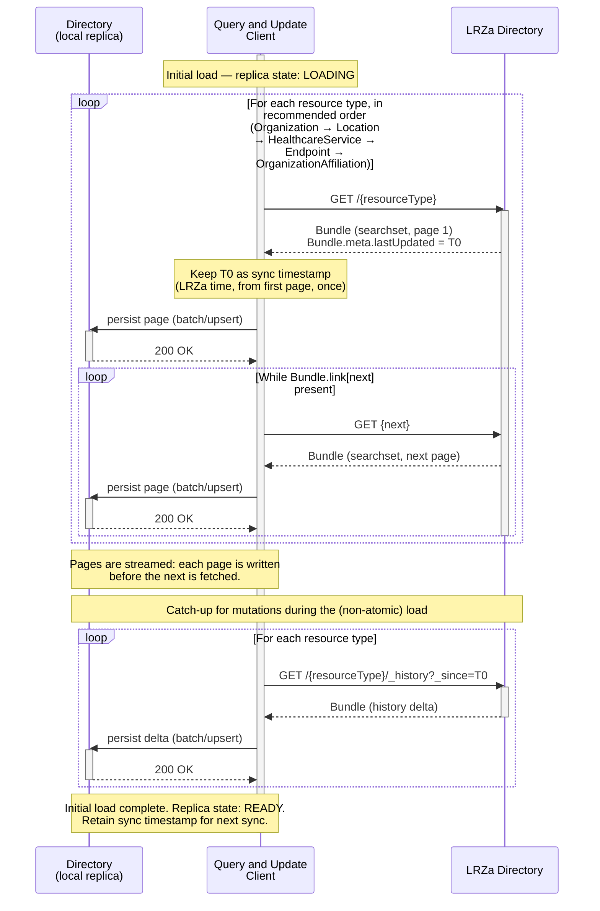
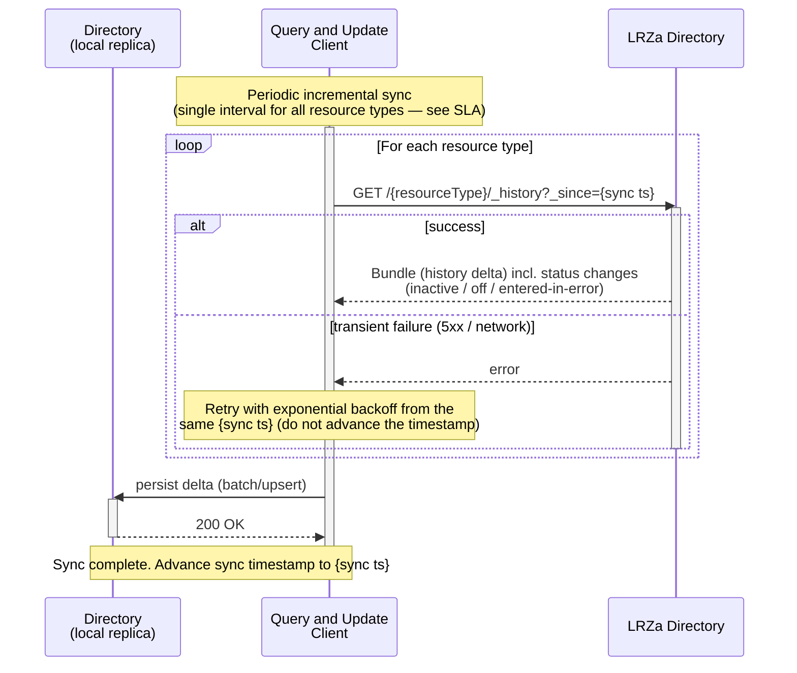
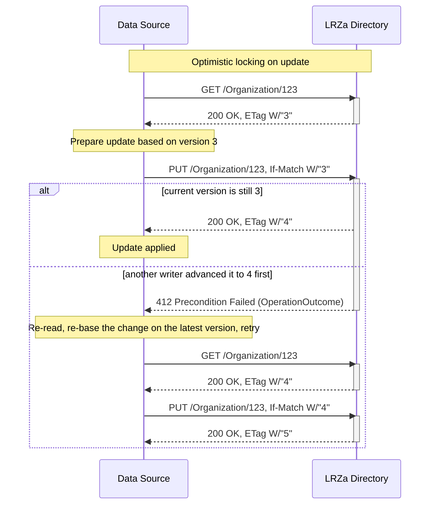
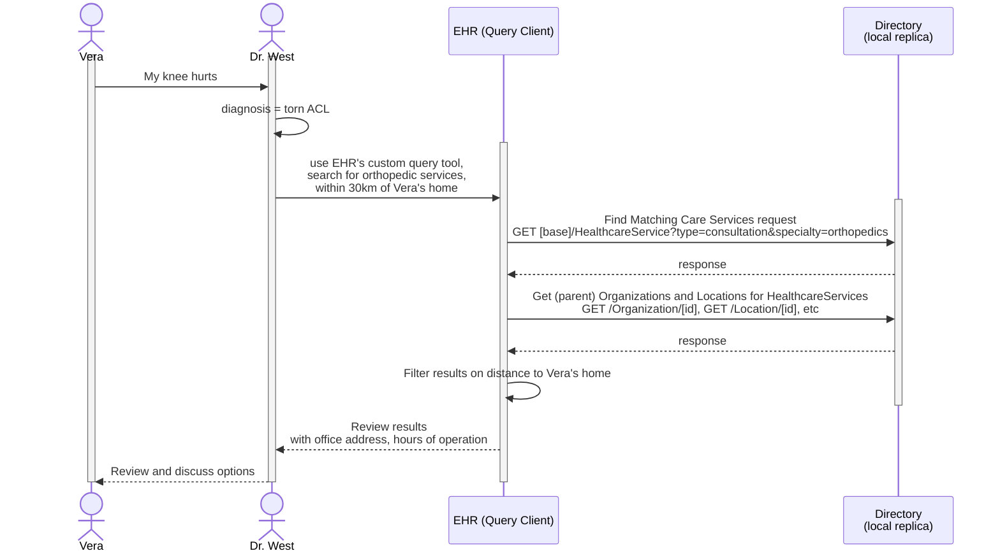
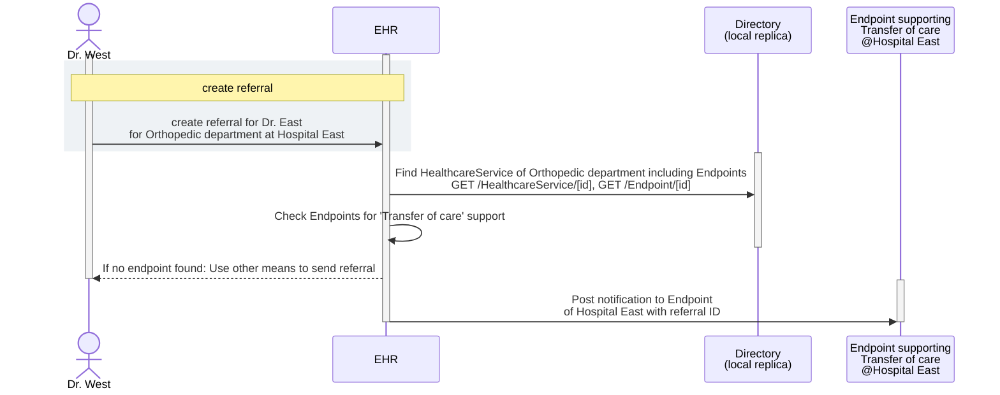
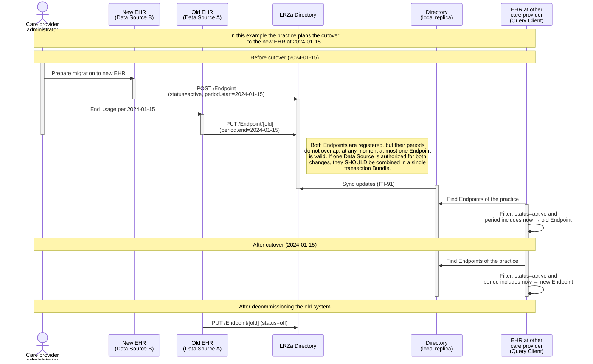

Generic Function Addressing (GFA) defines how healthcare parties can publish, discover, and use trusted addressing information for organizations, services, locations, and endpoints. Its purpose is to make healthcare data exchange interoperable and reliable by helping practitioners and systems route requests, referrals, data retrievals and notifications to the correct destination.  
This specification is based on the [IHE mCSD](https://profiles.ihe.net/ITI/mCSD/index.html) profile and reuses the actor and transaction definitions that were defined in that specification. You should be able to read this specification without prior knowledge of IHE mCSD, but a basic understanding of the FHIR specification is preferred.
{: .ig-lead}

### Solution overview

 Here is a brief overview of the processes that are involved: 

1. Every care provider registers one or more parties (e.g. an IT vendor) that is authorized to manage their addressable entities at the ['Directory'](#lrza-directory) of the 'Landelijk Register Zorgaanbieders' (LRZa). Care provider administrators register their addressable entities in an Service Provider application (e.g. an EHR).
1. The authorized Service Providers create and manage addressable entities in the LRZa Directory. In the schema below, this is represented as the 'Data source' performing 'Care Service Feed' transactions.
1. An 'Update Client' is used to copy and (periodically) fetch updates from the LRZa Directory to a local replica Directory. 
1. A practitioner and/or system (e.g. an EHR) can now use the local replica of the LRZa Directory to match resources defined within mCSD (for example: a practitioner searching for a healthcare service or a system searching for a specific endpoint)

This overview implies a decentralized architecture  with local Data Source actors and LRZa Directory replicas. An important central component is the LRZa Administration Directory, but this central component is not a crucial asset at data exchange runtime (only for creating or updating addressable entities). The LRZa Directory periodically imports Organization and Location resources from the KvK and Dezi-registry.

### National Constraints Compared to IHE mCSD

This specification is based on the [IHE mCSD](https://profiles.ihe.net/ITI/mCSD/index.html) profile and constrains and profiles the mCSD specification for the Dutch national context. The following national choices apply:

1. Data model profiling:
The national profiles SHALL be based on NL-core where available and SHALL be aligned with relevant IHE mCSD profile constraints.

1. LRZa Directory operational role:
The LRZa Directory SHALL NOT support matching of care service entities (e.g. query for a specific type of HealthcareService or Endpoint). Matching SHALL be performed on a local Directory (LRZa replica). The LRZa Directory SHALL act as the central consolidation and distribution point for the directory (a single consolidated view), and SHALL NOT have a direct operational role in healthcare data exchange transactions. For replication purposes, LRZa SHALL support `search-type` interactions from the mCSD ITI-90 transaction without search parameters for the initial load of the local replica. To bound load and keep operational matching on the replicas, the LRZa Directory SHALL restrict search operations to the minimum required for replication and SHALL apply rate limiting to operational consumers.
 
1. Paging and consistent initial load:
For the initial load (ITI-90-NL `search-type` without search parameters), the LRZa Directory SHALL return results using paging: it SHALL include `Bundle.link` with `relation = next` until all results are returned, and SHALL enforce a maximum page size. The maximum page size is advertised by the server and specified in the LRZa SLA. Update Clients SHALL follow `next` links until exhausted.
To reduce unresolved references during loading, Update Clients SHOULD load resource types in an order where referenced resources generally precede referencing resources (e.g. `Organization` → `Location` → `HealthcareService` → `Endpoint` → `OrganizationAffiliation`). Because the data model contains circular references (e.g. `Organization.endpoint` ↔ `Endpoint.managingOrganization`), no ordering can guarantee that every reference resolves during loading; this is why the order is `SHOULD`, not `SHALL`.
Because the paged initial load is not atomic, the Update Client SHALL take the server time reported in `Bundle.meta.lastUpdated` of the first page as the **sync timestamp** — the LRZa server time up to which the replica is in sync — and, once the paged load completes, SHALL perform an incremental `history-type` synchronization (ITI-91-NL) with `_since` set to that sync timestamp. Using the LRZa-reported time avoids client/server clock skew, and this captures mutations made during the load without requiring a server-side point-in-time snapshot. How the Update Client retains the sync timestamp is implementation-defined (e.g. a small stored value, or derived from the replica content); because synchronization is processed idempotently, an inclusive `_since` (re-fetching the boundary resources) is safe.

A Local Replica SHALL accept resources whose references cannot (yet) be resolved and SHALL NOT enforce referential integrity on write during the initial load; without this, replication breaks whenever a delta arrives before the resource it references. A Local Replica SHOULD NOT serve Query Clients until the initial load and the subsequent `_history` catch-up have completed.

Incremental synchronization (ITI-91-NL) is type-level (`{resourceType}/_history`, per mCSD ITI-91). Resource types SHOULD be synchronized on a single, common interval rather than per-type intervals: differentiating the interval per resource type would let a referencing resource of a fast-syncing type point at a not-yet-replicated resource of a slow-syncing type for a prolonged period. The LRZa SLA specifies the *most frequent* interval the Directory accepts (the rate limit), not how often a replica must synchronize; a replica chooses its own interval within that bound, short enough for the timeliness its use case needs. As a non-binding guideline, a synchronization interval of about 15 minutes is advised, which keeps endpoint and routing changes sufficiently fresh for referral and exchange workflows. Because synchronization can run in many decentralized instances, an Update Client SHOULD spread its synchronization moment across the interval (for example by applying a random offset) rather than synchronizing on fixed clock boundaries; this avoids a self-inflicted concurrency peak at the LRZa Directory. Synchronization is delta-based (`_history`), so a typical round returns a small or empty result and the average load per client is low; the peak driven by simultaneous requests is the relevant concern, which spreading mitigates.

The Update Client SHALL process incremental synchronization strictly sequentially rather than issuing `_history` requests in parallel: history entries SHALL be applied in chronological order (an older version SHALL NOT overwrite a newer one), and each `history-type` request (and each page of its response) SHALL complete and be applied before the next is issued. Sequential processing keeps the replica internally consistent, preserves the monotonic `_since` watermark on which retry depends, and bounds the request rate a single replica places on the LRZa Directory.

In steady state the Update Client therefore runs a simple loop: pull the incremental updates sequentially (advancing the `_since` watermark), wait for the synchronization interval (about 15 minutes, spread as described above), and repeat.

1. Concurrency control on updates:
The LRZa Directory SHALL support optimistic locking: it SHALL return an `ETag` (resource `versionId`) on read and on create/update responses, and SHALL honour the `If-Match` header on `update` interactions, rejecting an update that carries a stale version with HTTP `412 Precondition Failed` (the server advertises this through `versioning = versioned-update`). A Data Source SHALL send `If-Match` on updates and, on a `412`, re-read and re-apply. It prevents silent overwrite where a resource can be mutated through more than one channel (e.g. from CIBG as Data Source with update records from KvK/DEZI and one or more Data Sources). For more info on this topic, see [FHIR transactional integrity](http://hl7.org/fhir/R4/http.html#transactional-integrity) and [FHIR concurrency](https://hl7.org/fhir/R4/http.html#concurrency)

1. Mutation signing (optional):
Digitally signing mutations with a FHIR `Provenance` resource is currently OPTIONAL. The LRZa Directory SHALL NOT require a digital signature to accept a mutation, and the absence of a `Provenance` SHALL NOT be a reason for rejection. A Data Source MAY accompany a mutation with a signed `Provenance` resource that references the stored resource. When a `Provenance` is present, the LRZa Directory SHALL verify its signature against the relevant trust chain (a `Provenance` is signed with a PKIoverheid certificate of the organization; a UZI certificate is provisionally allowed on the `OrganizationAffiliation` mandate) and SHALL reject an invalid signature with an `OperationOutcome`. Provenance records are stored in the LRZa Directory and synchronized to local replicas (see ITI-90-NL/ITI-91-NL), so that any party that wishes to — replica operators, auditors or supervisors — MAY independently verify the origin and integrity of an accepted mutation without having to trust the LRZa on its word. As a growth path, use of digital signatures may be made mandatory later; see [Roadmap](#roadmap-for-care-services). For a worked, step-by-step example of creating and verifying a signature, see [Resource signing](signing.html).

### Actors
Each actor will now be discussed in more detail.

#### LRZa Directory
The LRZa Directory is the central national directory for publishing and distributing addressable entities. It is the authoritative source for nationally governed directory content and provides interfaces for administration and retrieval of updates. The LRZa Directory is not intended for runtime matching in operational healthcare workflows; searching/matching SHALL be performed on local replicas. This Directory provides an API for the 'Data Source' and 'Update Client' that implements these CapabilityStatements:
- for Data Source clients: [ITI-130-NL](./CapabilityStatement-nl-gf-directory-for-ITI-130-NL.html)
- for Update Clients: [ITI-90-NL](./CapabilityStatement-nl-gf-directory-for-ITI-90-NL.html) and [ITI-91-NL](./CapabilityStatement-nl-gf-directory-for-ITI-91-NL.html)

#### Data Source
A Data Source is a client/actor of an authorized party (e.g. an IT vendor or the care provider itself) that publishes and maintains directory entities on behalf of care providers. The Data Source actor SHALL use interactions conforming to [CapabilityStatement ITI-130-NL](./CapabilityStatement-nl-gf-directory-for-ITI-130-NL.html), including create/update for Organization, Location, HealthcareService, and Endpoint.

#### Update Client
The Update Client refers to two separate actors defined in [IHE mCSD](https://profiles.ihe.net/ITI/mCSD/index.html) a 'lite version' of the Query Client and the Update Client. These clients are grouped for the Dutch national context. This actor uses the `search-type` interaction (without search parameters) for the initial load of the local Directory (replica). It also periodically synchronizes from the LRZa Directory to a local replica using `history-type` interactions and `_since` parameter to request incremental updates. It consumes search interactions conforming to [CapabilityStatement ITI-90-NL](./CapabilityStatement-nl-gf-directory-for-ITI-90-NL.html) and update-oriented interactions defined in [CapabilityStatement ITI-91-NL](./CapabilityStatement-nl-gf-directory-for-ITI-91-NL.html).
The Update Client *synchronizes* (replicates) directory content; it does *not* aggregate. Aggregation of source registers and self-registered data is performed centrally by the LRZa Directory. Incremental synchronization SHALL be processed idempotently (re-applying a delta SHALL be safe), and on transient failure the client SHALL retry from the last successfully processed `_since` watermark.
For more information, see the [initial load](#use-case-2a-update-client-initial-load) and [incremental sync](#use-case-2b-update-client-incremental-sync) examples.

#### Query Client
The Query Client uses the local replica to find organizations, healthcare services, locations, endpoints, and organizational relationships for routing and discovery. 
Note that the data exchange between Query Client and (local) Directory MAY use a proprietary interface. [Use case 3](#use-case-3-healthcare-service-query) and [use case 4](#use-case-4-endpoint-discovery) illustrate how to search for healthcare services and endpoints. 

When selecting an Endpoint for data exchange, the Query Client SHALL only use Endpoints that have status `active` and whose `period`, when present, includes the current time. Within that selection, the Query Client matches on `connectionType` and `payloadType` (see [use case 4](#use-case-4-endpoint-discovery)). When multiple valid Endpoints remain for the same Organization or HealthcareService and the same `connectionType`/`payloadType` combination, this indicates either intentional redundancy (multiple endpoints due to different software systems) or a registration error.

Note: FHIR R4 does not define a search parameter for `Endpoint.period`, so the period is evaluated by the Query Client after retrieving candidate Endpoints from the local replica.

### Transactions

Transactions between Service Providers and the LRZa are defined here. Other (local or 3rd party) transactions are not specified here. These transactions MAY reuse/adopt IHE mCSD and FHIR transactions, but are not obliged.  

#### Care Services Feed: ITI-130-NL
The Data Source publishes entities to the LRZa Directory using create/update semantics as profiled in the Data Source capability statement. Submitted resources SHALL be validated against the applicable NL-GF profile; invalid resources SHALL be rejected with an `OperationOutcome`. Resources SHOULD not be deleted; withdrawal SHOULD be expressed through a status change. Updates SHALL use optimistic locking (`If-Match`), which the server supports (see "Concurrency control on updates"). Resources may be published individually or in a `transaction` (all-or-nothing). A Data Source MAY additionally submit a signed `Provenance` referencing the stored resource; this is optional, see [Resource signing](signing.html).
CapabilityStatement: [ITI-130-NL](./CapabilityStatement-nl-gf-directory-for-ITI-130-NL.html)

#### Search Care Services: ITI-90-NL
The Update Client loads/queries directory data for initial population of the local replication using `search-type` interactions without search parameters. The initial load is paged (see National Constraint "Paging and consistent initial load").
CapabilityStatement: [ITI-90-NL](./CapabilityStatement-nl-gf-directory-for-ITI-90-NL.html)

#### Request Care Services Updates: ITI-91-NL
The Update Client retrieves changes from the LRZa Directory using `history-type` interactions per supported resource, optionally constrained by `_since` for incremental synchronization.
CapabilityStatement: [ITI-91-NL](./CapabilityStatement-nl-gf-directory-for-ITI-91-NL.html)

#### Error handling and resilience
All transactions SHALL return a standard FHIR `OperationOutcome` with an appropriate HTTP status code (e.g. `400` malformed request, `412` stale version on a concurrent update, `422` profile validation failure, `429` too many requests when rate limiting applies, `5xx` server error). Clients (Data Source, Update Client) SHALL implement retry with exponential backoff for transient failures (`5xx`, network) and SHALL process synchronization idempotently. When the LRZa Directory applies rate limiting and responds with `429 Too Many Requests`, the client SHALL honor the `Retry-After` header where present and back off before retrying, rather than retrying immediately. A Query Client reads whatever the local replica currently holds; it cannot itself resolve staleness and relies on the Update Client's next synchronization to bring in newer data. Where a workflow cannot tolerate the replica's bounded staleness for a critical decision, the consuming application verifies the relevant information out of band (e.g. directly against the addressed party) rather than treating the directory as authoritative for that decision.

### Entities
Within GF Addressing, several addressable entities are used to capture and publish information. 
An overview of the *most common* elements and relations between entities:

A brief description of the entities:

#### HealthcareService
Healthcare services are used to publish which (medical) services are provided by a (child) Organization at some Location(s). Examples include surgical services, antenatal care services, or primary care services. These services in `HealthcareService.type` can be extended by references to specific ActivityDefinitions and PlanDefinitions that are supported. The combination of a HealthcareService offered at a Location may have specific attributes including contact person, hours of operation, etc. Typically, HealthcareServices use Endpoints that support receiving notifications or requests. 
The [NL-GF-HealthcareService profile](./StructureDefinition-nl-gf-healthcareservice.html) is used to represent healthcare service offerings.

Key attributes:

| Attribute | Card. | Description |
|---|---|---|
| identifier (CustodianAssignedIdentifier) | 1..1 | identifier for provenance and traceability. |
| providedBy → Organization | 1..1 | The organization that provides this service. |
| type | 1..* | The type of service (required binding to [NL-GF Service Types](./ValueSet-nl-gf-service-types-vs.html), including procedure and care-type codesystems in CBV, DHD, Geboortezorg, GGZ, NHG, NZa and WLZ). |
| type.supportedActivityDefinitions | 0..* | References to ActivityDefinitions or PlanDefinitions specifying the service type further. |
| specialty | 0..* | The specialty of the service (required binding). |
| name | 0..1 | A human-readable name for the service. |
| telecom | 0..* | Contact details for the service. |
| location → Location | 0..* | The location(s) where this service is available. |
| availableTime | 0..* | Times the service is available. |
| endpoint → Endpoint | 0..* | Technical endpoints for notifications or requests. |

#### Organization
Organizations are “umbrella” entities; these may be considered the administrative bodies under whose auspices care services are provided. Typically, (top-level)Organization-instances use Endpoints that publish healthcare data for other (healthcare) organizations to query. Departments of an institution, or other administrative units, may be represented as child Organizations of a parent Organization.
The [NL-GF-Organization profile](./StructureDefinition-nl-gf-organization.html) is used to represent organizations and their hierarchical relations in this guide. Key attributes:

| Attribute | Card. | Description |
|---|---|---|
| identifier (URA or KVK) | 0..* | An Organization SHALL have a URA identifier, or be `partOf` another Organization. |
| type | 1..* | Type of organization, including an SBI (Standaard Bedrijfsindeling) code (extensible binding to [NL-GF Organization Types](./ValueSet-nl-gf-org-types-vs.html)). |
| name | 1..1 | The name of the organization. |
| alias | 0..* | Alternative names. |
| telecom | 0..* | Contact details. |
| partOf → Organization | 0..1 | The parent organization (for departments or sub-units). |
| endpoint → Endpoint | 0..* | Technical endpoints used by this organization. |

#### Endpoint
An addressable entity may be reachable for electronic data exchange through electronic Endpoint(s). An Endpoint may be a FHIR server, a DICOM web service, OAuth token endpoint, or some other mechanism. Typically, Organizations and HealthcareServices refer to Endpoints. This relationship is meant to indicate that, e.g., a care provider (Organization) ***uses*** an Endpoint. An Endpoint also refers to one specific organization that manages the Endpoint (e.g. IT vendor); this is not the organization ***using*** the endpoint.
The [NL-GF-Endpoints profile](./StructureDefinition-nl-gf-endpoint.html) is used to represent electronic access points for data exchange. Key attributes:

| Attribute | Card. | Description |
|---|---|---|
| status | 1..1 | The operational status of the endpoint (e.g. active, off). |
| period | 0..1 | The interval during which the endpoint is expected to be operational. An absent `period.end` means the endpoint is operational until further notice. |
| connectionType | 1..1 | The type of connection (extensible binding to [Core connection types](https://hl7.org/fhir/R4/valueset-endpoint-connection-type.html) and [NL-GF Connection Types](./ValueSet-nl-gf-connection-types-vs.html)). |
| payloadType | 1..* | The payload type(s) supported (extensible binding to [NL-GF Payload Types](./ValueSet-nl-gf-payload-type-vs.html)). |
| payloadMimeType | 0..* | The mime type(s) of the payload, including the standard version for FHIR endpoints (e.g. `application/fhir+json; fhirVersion=4.0`). |
| address | 1..1 | The technical address (URL) of the endpoint. |
| managingOrganization → Organization | 1..1 | The organization that manages this endpoint (e.g. IT vendor). |

##### Scope of Endpoint information

The purpose of an Endpoint in this directory is *discovery*: it tells a system *where* a service can be reached and *which* technical protocol and payload to use (`connectionType`, `payloadType`, `payloadMimeType`, `address`). The terms of use, authentication requirements and security requirements that apply when actually invoking an Endpoint are determined by the trust framework ("afsprakenstelsel") within which the exchange takes place, not by the directory entry. Registering Endpoints centrally is valuable precisely because it makes them discoverable across trust frameworks and use cases, independent of conditions that govern their use.

The directory therefore does not carry per-Endpoint terms of use, authentication or security policy. Transport security for publishing to the LRZa Directory is covered under [Security](#security); the broader authentication and security requirements for invoking endpoints are addressed in the dedicated security and authentication tracks (see epics [security (#854)](https://github.com/minvws/generiekefuncties-architectuur/issues/854) and [authentication means (#855)](https://github.com/minvws/generiekefuncties-architectuur/issues/855)).
##### Versioning and conformance

Systems may support multiple versions of a standard at the same time, for instance during the transition from FHIR STU3 to FHIR R4 (zib2017 to zib2020). The version of the standard is therefore part of the selection criteria for an Endpoint and is expressed machine-readably in `payloadMimeType`:

- An Endpoint with a FHIR-based `connectionType` (e.g. `hl7-fhir-rest`) SHALL include the FHIR version in its `payloadMimeType` values, using the standard [`fhirVersion` MIME-type parameter](https://hl7.org/fhir/R4/http.html#version-parameter): `application/fhir+json; fhirVersion=4.0` (R4) or `application/fhir+json; fhirVersion=3.0` (STU3).
- A system that serves multiple FHIR versions on the same address lists multiple `payloadMimeType` values on a single Endpoint. A future payload version migration therefore does not require registering a new Endpoint; separate Endpoints are only needed when the versions are served on different addresses.
- When selecting an Endpoint, a Query Client matches on `connectionType`, `payloadType` and — when the payload version matters for the exchange — `payloadMimeType` including its `fhirVersion` parameter.
- Free-text fields such as `Endpoint.name` MAY mention a version for readability, but systems SHALL NOT rely on free-text fields for version selection; `payloadMimeType` is the normative source.

The Directory only carries the metadata needed for *selecting* an Endpoint (`connectionType`, `payloadType`, `payloadMimeType`). How detailed conformance information is obtained depends on the connection type:

- FHIR endpoints: the CapabilityStatement of the system itself, available at runtime via `[address]/metadata`.
- IHE SOAP-based profiles (e.g. XDS, XCA): these have no runtime conformance interface; conformance is established out-of-band through IHE Integration Statements and the qualification/admission within the applicable trust framework ("afsprakenstelsel"). What a receiving system can process is declared per document (e.g. `formatCode` in the document metadata), not per Endpoint.
- DICOM(web) endpoints: the vendor's DICOM Conformance Statement.

##### Endpoint lifecycle and transition

An Endpoint's validity can expressed through `status` and `period`:

- `status` describes the operational state of the endpoint itself (`active`, `suspended`, `off`, `entered-in-error`).
- `period` describes the interval during which the endpoint is expected to be operational. An Endpoint without `period.end` is operational until further notice. A `period.start` in the future MAY be used to announce an endpoint ahead of its activation; no separate scheduling mechanism is provided.

When a care provider migrates to another system, the Endpoints of the old and the new system may be *registered* simultaneously, but their periods SHALL be set such that at most one of them is *valid* at any moment: the superseded Endpoint receives a `period.end` at the planned cutover moment and the replacing Endpoint a `period.start` at that same moment. This removes any ambiguity about which Endpoint to use during a transition: data exchange partners select the Endpoint whose period includes the current time (see [Query Client](#query-client)). When a single Data Source is authorized for both changes, it SHOULD apply them atomically in one FHIR transaction Bundle. When two different service providers are involved, both can safely register their change ahead of the cutover moment, because Endpoint selection is driven by `period`, not by registration time.

After the old system has actually been taken out of operation, its Endpoint status SHOULD be set to `off` or deleted.

[Use case 5](#use-case-5-endpoint-transition) illustrates a transition between systems.

#### Location
Locations are physical places where care can be delivered such as buildings (NL: Vestiging), wards, rooms, or vehicles. A Location may have geographic attributes (address, geocode), attributes regarding its hours of operation, etc. Each Location is related to one Organization. A location may have a hierarchical relationship with other locations (e.g. building > floor > room).
The [NL-GF-Location profile](./StructureDefinition-nl-gf-location.html) is used to represent physical care-delivery locations. Key attributes:

| Attribute | Card. | Description |
|---|---|---|
| identifier (CustodianAssignedIdentifier) | 1..1 | identifier for provenance and traceability. |
| name | 1..1 | The name of the location. |
| type | 1..1 | The type of location. |
| status | 1..1 | The operational status (e.g. active, inactive). |
| address | 0..1 | The physical address. |
| managingOrganization → Organization | 1..1 | The organization responsible for this location. |
| partOf → Location | 0..1 | The parent location (e.g. building → floor → room). |

#### OrganizationAffiliation
OrganizationAffiliation resources are used to represent relationships between organizations, primarily a software vendor managing the Endpoint that is used by a care provider. The LRZa Directory uses OrganizationAffiliations to authorize incoming create and update interactions of service providers. It could also be used to represent multiple care providers working together under some agreement (e.g. in a region).
The [NL-GF-OrganizationAffiliation profile](./StructureDefinition-nl-gf-organizationaffiliation.html) is used to represent organizational relationships in this guide. Key attributes:

| Attribute | Card. | Description |
|---|---|---|
| active | 1..1 | Whether this affiliation is currently active. |
| organization → Organization | 1..1 | The care provider organization. |
| participatingOrganization → Organization | 1..1 | The affiliated party (e.g. IT vendor). |
| code | 1..* | The type of affiliation (required binding to [NL-GF Authorization Types](./ValueSet-nl-gf-affiliation-type-vs.html)). |

#### Provenance
A `Provenance` resource records the origin and (optionally) a digital signature of a mutation submitted to the LRZa Directory. Signing is optional; when present, a `Provenance` makes the origin and integrity of an accepted mutation independently verifiable by the LRZa Directory, local replicas, auditors and supervisors. A `Provenance` references the stored version of the mutated resource and carries a signature computed over the canonical JSON form of that resource. See the [signed Provenance example](./Provenance-b7d9e2a1-4c3f-5a6b-8e0d-1f2a3b4c5d6e.html) for an `OrganizationAffiliation` mandate, and the [Resource signing](signing.html) page for the step-by-step derivation of its signature. Key attributes:

| Attribute | Card. | Description |
|---|---|---|
| target → (mutated resource) | 1..* | A reference(s) to the stored resource this Provenance covers (e.g. `OrganizationAffiliation/{id}`). |
| recorded | 1..1 | The instant the Provenance record was created. |
| agent.type | 0..1 | Role of the agent, e.g. `author` from the [provenance participant type](http://terminology.hl7.org/CodeSystem/provenance-participant-type) code system. |
| agent.who → Organization | 1..1 | The organization responsible for the mutation (the care provider for an `OrganizationAffiliation` mandate, or the authorized Data Source for other mutations). |
| signature.type | 1..* | The signature purpose, from [`urn:iso-astm:E1762-95:2013`](https://hl7.org/fhir/R4/valueset-signature-type.html) (e.g. `1.2.840.10065.1.12.1.1` "Author's Signature"). |
| signature.when | 1..1 | The instant the signature was created. |
| signature.who → Organization | 1..1 | The signer. For an `OrganizationAffiliation` mandate this is the care provider (certificate: UZI or PKIoverheid); for other mutations the authorized Data Source (PKIoverheid). |
| signature.targetFormat | 0..1 | The mime type of the signed content: `application/fhir+json;canonicalization=http://hl7.org/fhir/canonicalization/json#static`. |
| signature.sigFormat | 0..1 | The mime type of the signature itself: `application/jose` (a detached JWS). |
| signature.data | 1..1 | The base64-encoded detached JWS signature. |

The signature is computed over the **canonical JSON** form of the referenced resource, using canonicalization type `http://hl7.org/fhir/canonicalization/json#static`. This is the FHIR *static* JSON canonicalization: it fixes element ordering to the order defined by the specification and removes insignificant whitespace, so that a replica, auditor or supervisor can reproduce the exact byte sequence that was signed and verify the signature independently. Fixing the canonicalization method is what makes the signature verifiable across parties; both signer and verifier SHALL apply `http://hl7.org/fhir/canonicalization/json#static` before, respectively, computing and checking the detached JWS carried in `signature.data`.

#### Not in scope: Practitioner and PractitionerRole

The data model of the IHE mCSD contains resourcetypes/profiles for Practioner and PractitionerRole. These entities are NOT in scope of the Generic Function Addressing. The main reason is that there is currently no legal basis for the processing of data of healthcare professionals by the 'Landelijk Register Zorgaanbieders' (LRZa).

### Security

A Data Source actor SHALL use mTLS for transport layer security. Qualified certificates from Qualified Trusted Service Providers (like PKIoverheid) should be trusted. ([GF-Adressering, ADR#178](https://github.com/minvws/generiekefuncties-adressering/issues/178)).
The LRZa-Directory SHALL only support creation/updates of OrganizationAffiliations by Care Providers, not by the parties that are being authorized (the `.participatingOrganization`).

#### Mutation signing (optional)

Beyond transport security, mutations MAY be signed at record level with a FHIR `Provenance` resource (see National Constraint "Mutation signing (optional)"). Signing is currently *not* mandatory: the LRZa Directory accepts mutations without a `Provenance`. When a `Provenance` is present, the LRZa Directory SHALL verify its signature, and parties that wish to (replica operators, auditors, supervisors) MAY verify it as well. A `Provenance` is signed with a PKIoverheid certificate of the organization; because not every care provider holds a PKIoverheid certificate, a UZI certificate is provisionally allowed for signing the `Provenance` on the `OrganizationAffiliation` (the mandate expressing which Data Source may mutate on behalf of which care provider). This makes the provenance chain of each accepted record independently verifiable and detectable across the whole system, without introducing a new certificate chain. The [Resource signing](signing.html) page gives a worked example of how such a signature is created and verified.

### Example use cases

#### Use Case #1: Admin Registers Affiliation, Service Provider Publishes Resources
This sequence shows a two-step onboarding flow: first, the care provider administrator creates an OrganizationAffiliation that authorizes the service provider. After this authorization exists, the service provider is able to register their Endpoints (if not already registered). Finally, the care provider administrator is able to register and update the remaining mCSD resource types in the application of the service provider (e.g. the EHR).

#### Use Case #2a: Update Client Initial Load
The following sequence diagram illustrates how an Update Client performs the paged initial load of a local replica, records the sync timestamp, and runs a `_history` catch-up before serving Query Clients:

#### Use Case #2b: Update Client Incremental Sync
The following sequence diagram illustrates the periodic incremental synchronization, including delta processing, status changes, retry on transient failure, and advancing the sync timestamp:

#### Use Case #2c: Optimistic Locking on Update
The following sequence diagram illustrates the recommended optimistic-locking flow when a Data Source updates a resource: it reads the current `ETag`, sends the update with `If-Match`, and — if another writer advanced the version first — receives `412 Precondition Failed`, then re-reads and retries:

#### Use Case #3: Healthcare service Query
The patient, Vera Brooks, consults with her physician who recommends surgery. The physician can assist the patient in finding a suitable care provider, taking into consideration the location and specialty for orthopedic surgeons.
- Vera Brooks sees her family physician, Dr. West, regarding a recent knee injury.
- Dr. West diagnoses the problem as a torn ACL and decides to refer Vera to a clinic that provides orthopedic specialists.
- Dr. West uses her EHR query tool, which implements a Query Client to search for orthopedic healthcare services within 30km of Vera’s home.
- The EHR retrieves the information from the Directory and displays it to Dr. West.
- Vera and Dr. West decide on the Orthopedic department at Hospital East; Dr. West prepares a referral.

#### Use Case #4: Endpoint Discovery
Dr. West just created a referral (for patient Vera Brooks from use case #3). The EHR has to notify Hospital East and the Orthopedic department of this referral. This may include some recurring requests:
- The EHR looks up the HealthcareService instance of the Orthopedic department at the (local) Directory, fetches the related endpoints and checks if these support a 'Request' payloadType. The EHR sends the notification and referral-workflow continues.

#### Use Case #5: Endpoint Transition
The general practice from use case #1 replaces its EHR system and plans a cutover moment at which the new system takes over:
- The new service provider registers the Endpoint(s) of the new system with `period.start` set to the cutover moment.
- The superseded Endpoint receives a `period.end` at the same cutover moment — applied by the currently authorized service provider, or combined with the previous step in one transaction Bundle when a single Data Source is authorized for both changes.
- Update Clients synchronize both registrations to the local replicas. Query Clients keep selecting the old Endpoint until the cutover moment, and the new Endpoint thereafter; at no moment are both Endpoints valid.
- After the old system is decommissioned, its Endpoint status is set to `off`.

### Roadmap for Care Services

- Security specifications must be aligned with LDN 'veilig netwerk' specifications
- Digital signing of mutations (FHIR `Provenance`) is currently optional; making it mandatory will hardening security and trustworthiness of the data 
- Versioning of information standards / implementation guides per Endpoint (e.g. which zib release or IG package) is to be elaborated in alignment with the national choice of standards ([epic standaardenkeuze](https://github.com/minvws/generiekefuncties-architectuur/issues/876)); the NDH [fhir-ig extension](https://hl7.org/fhir/us/ndh/StructureDefinition-base-ext-fhir-ig.html) is a candidate mechanism.