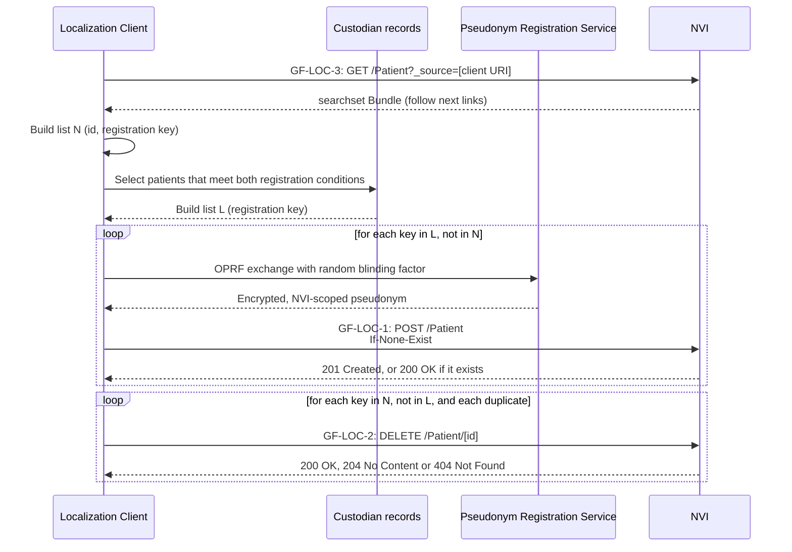
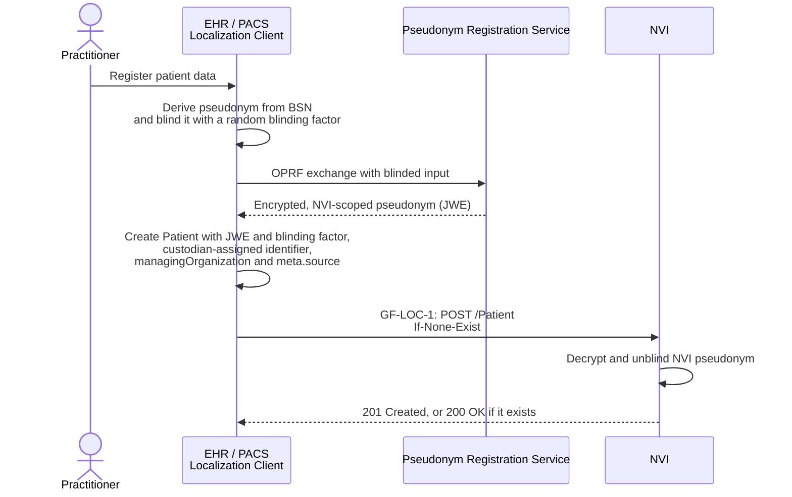
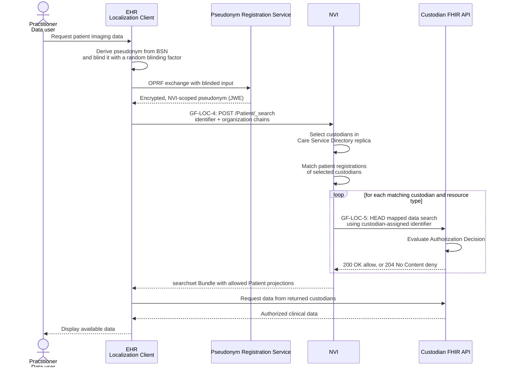

GF Localization enables healthcare professionals to find care providers (custodians) that hold relevant data for a patient. The Nationale Verwijs Index (NVI) stores one `Patient` resource per patient and custodian. A data user searches by the patient's NVI pseudonym and optional custodian properties, and receives only custodians that return an allow Authorization Decision.
{: .ig-lead}

### Scope

This page specifies:
- how a custodian registers and maintains its patients at the NVI;
- how a data user searches the NVI for custodians that hold relevant data;
- how the NVI asks each custodian for an Authorization Decision before it returns that custodian.

This page does not specify:
- how the data user retrieves the data itself. The data user requests data directly from the custodian's FHIR API, which authorizes each request;
- how pseudonyms are derived. See [GF Pseudonymization](./pseudonymisation.html);
- how custodians, their Endpoints and their healthcare services are published. See [GF Care Service Directory](./csd.html);
- Authorization Decisions for non-FHIR APIs, such as DICOM.

### Terminology

| Term | Meaning |
|---|---|
| GF Localization | The generic function specified on this page. |
| NVI | Nationale Verwijs Index, the Data Localization Index. The central service that stores registrations and answers searches. |
| Custodian | A care provider that holds data for a patient and registers that patient at the NVI. |
| Data user | A care provider and practitioner who search for custodians that hold relevant data for a patient. |
| Localization Client | The software, such as an EHR or PACS, that communicates with the NVI. It acts for a custodian when it registers, and for a data user when it searches. When this page says that a custodian or data user sends a request, its Localization Client sends it. |
| Registration | A `Patient` resource at the NVI that states that one custodian holds data for one patient. |
| NVI pseudonym | The patient identifier at the NVI. The [Pseudonym Registration Service (PRS)](./pseudonymisation.html) derives it from the BSN for the NVI only. |
| Custodian-assigned identifier | The custodian's own patient identifier. The NVI uses it to request Authorization Decisions from that custodian. |
| Search context | The custodian properties that a data user searches on, such as care provider type or healthcare-service type. See [Search context](#search-context). |
| Authorization Decision | A custodian's allow or deny answer to the question whether the data user may access its data for the patient. See [GF-LOC-5](#gf-loc-5-authorization-decision). |

### Solution overview

Custodians first register patients whose data they manage:

1. The custodian generates a random blinding factor. It uses this factor in an oblivious pseudorandom function (OPRF) exchange with the PRS to obtain an encrypted, NVI-scoped pseudonym for the patient.
2. The custodian registers a `Patient` resource for that patient and custodian at the NVI.


<!--  -->

A data user can then discover relevant custodians:

1. The data user determines the custodian search criteria and data categories relevant to the care need.
2. The data user generates a random blinding factor and uses it in an OPRF exchange with the PRS to obtain the patient's encrypted, NVI-scoped pseudonym.
3. The data user queries the NVI for the patient, specifying which custodians are relevant by properties such as care provider ID (URA), care provider type, Endpoint payload type, or healthcare-service type.
4. The NVI selects relevant custodians by matching the query against its local [Care Service Directory replica](./csd.html#lrza-directory).
5. The NVI searches its registrations for `Patient` resources that match the patient's pseudonym and belong to one of the selected custodians.
6. For each matching custodian, the NVI requests an Authorization Decision. The NVI returns only custodians with an allow Authorization Decision.
7. The data user discovers the custodians' data Endpoints through the Care Service Directory and requests data directly from them. Custodians authorize each data request independently.


<!--  -->

### Actors

| Actor | Role | Transactions | Requirements |
|---|---|---|---|
| [NVI](#nvi) | Stores registrations, answers searches, and requests Authorization Decisions | Server for [GF-LOC-1](#gf-loc-1-register-patient) to [GF-LOC-4](#gf-loc-4-search-localization); client for [GF-LOC-5](#gf-loc-5-authorization-decision) | [CapabilityStatement](./CapabilityStatement-nl-gf-localization-repository-patient.html), [Patient profile](./StructureDefinition-nl-gf-localization-patient.html) |
| [Localization Client](#localization-client) | Registers and maintains patients for a custodian; searches for a data user | Client for [GF-LOC-1](#gf-loc-1-register-patient) to [GF-LOC-4](#gf-loc-4-search-localization) | [Patient profile](./StructureDefinition-nl-gf-localization-patient.html), [Registration lifecycle](#registration-lifecycle) |
| [Custodian](#custodian) | Answers Authorization Decisions on its FHIR Endpoint | Server for [GF-LOC-5](#gf-loc-5-authorization-decision) | This page; no CapabilityStatement yet (see [Open issues](#open-issues)) |
| [Pseudonym Registration Service](#pseudonym-registration-service) | Evaluates the OPRF for NVI pseudonyms | See [GF Pseudonymization](./pseudonymisation.html) | [GF Pseudonymization](./pseudonymisation.html) |

#### NVI

The NVI SHALL implement these [FHIR capabilities](./CapabilityStatement-nl-gf-localization-repository-patient.html). It is the server for [GF-LOC-1](#gf-loc-1-register-patient) to [GF-LOC-4](#gf-loc-4-search-localization), and the client for [GF-LOC-5](#gf-loc-5-authorization-decision).

#### Localization Client

The Localization Client SHALL support [GF-LOC-1](#gf-loc-1-register-patient) to [GF-LOC-3](#gf-loc-3-retrieve-registrations) when it acts for a custodian, and [GF-LOC-4](#gf-loc-4-search-localization) when it acts for a data user. When it acts for a custodian, it SHALL follow the [Registration lifecycle](#registration-lifecycle).

#### Custodian

A custodian exposes its data through a FHIR API registered in the [Care Service Directory](./csd.html). Its FHIR Endpoint is the server for [GF-LOC-5](#gf-loc-5-authorization-decision).

#### Pseudonym Registration Service

The Pseudonym Registration Service (PRS) provides OPRF evaluations used by clients to derive recipient-scoped pseudonyms from patient identifiers using HKDF and OPRF protocols. See [GF Pseudonymization](./pseudonymisation.html) for the full specification and the [reference implementation](https://github.com/minvws/gfmodules-nationale-verwijsindex-registratie-service/blob/main/test_flow/OPRF.py).

### Transactions

| ID | Transaction | Client | Server |
|---|---|---|---|
| GF-LOC-1 | [Register Patient](#gf-loc-1-register-patient) | Localization Client | NVI |
| GF-LOC-2 | [Delete Patient](#gf-loc-2-delete-patient) | Localization Client | NVI |
| GF-LOC-3 | [Retrieve Registrations](#gf-loc-3-retrieve-registrations) | Localization Client | NVI |
| GF-LOC-4 | [Search Localization](#gf-loc-4-search-localization) | Localization Client | NVI |
| GF-LOC-5 | [Authorization Decision](#gf-loc-5-authorization-decision) | NVI | Custodian |

#### GF-LOC-1: Register Patient

The Localization Client registers that a custodian holds data for a patient.

**Artifacts.** [CapabilityStatement](./CapabilityStatement-nl-gf-localization-repository-patient.html) (`create` interaction), [Patient profile](./StructureDefinition-nl-gf-localization-patient.html), [Patient example](./Patient-nl-gf-localization-patient-example.html).

**Request.** The client SHALL register with a conditional create, so a retry never creates a second registration:

```
POST [base]/Patient
If-None-Exist: identifier=[custodian-assigned identifier]&_source=urn:generiekefuncties:nvi:client-id:{client_id}
```

Each registered Patient SHALL contain:
- the NVI pseudonym in `identifier` with system `http://generiekefuncties.nl/nvi/identifier`;
- the custodian-assigned Patient identifier, with the custodian as its `Identifier.assigner`;
- the custodian's ID in `managingOrganization.identifier`;
- the registering OAuth `client_id` represented as a URI in `meta.source`, using the form `urn:generiekefuncties:nvi:client-id:{client_id}`.

The custodian-assigned identifier SHALL be accepted as the `patient` search value at the custodian's FHIR Endpoint.

**NVI pseudonym.** Before registering, the client SHALL obtain the NVI pseudonym from the [Pseudonym Registration Service (PRS)](./pseudonymisation.html). The client packages the JWE and `blind_factor` together as a JSON object:

```json
{
  "evaluated_output": "<JWE compact serialization>",
  "blind_factor": "<base64url-encoded blind_factor>"
}
```

The client places this object, base64url-encoded, in the NVI `Patient.identifier` value. The NVI decrypts and unblinds it before storing the resulting pseudonym. See the [Patient example](./Patient-nl-gf-localization-patient-example.html).

**Response.**

| Status | Meaning |
|---|---|
| `201 Created` | The NVI created the registration. |
| `200 OK` | A matching registration exists. The NVI returns it and does not create a new one. |
| `412 Precondition Failed` | More than one registration matches the condition. The client SHALL delete the duplicates (see [Reconciliation](#reconciliation)). |

For other errors, see [Error handling](#error-handling).

#### GF-LOC-2: Delete Patient

The Localization Client deletes a registration.

**Artifacts.** [CapabilityStatement](./CapabilityStatement-nl-gf-localization-repository-patient.html) (`delete` interaction).

**Request.**

```
DELETE [base]/Patient/[id]
```

**Response.**

| Status | Meaning |
|---|---|
| `200 OK` or `204 No Content` | The NVI deleted the registration. |
| `404 Not Found` | The registration does not exist. The client SHALL treat this as success. |

The NVI does not support updates. To change a registration, for example after a new custodian-assigned identifier or a patient merge, the client SHALL delete the registration and register a new one.

#### GF-LOC-3: Retrieve Registrations

The Localization Client retrieves the registrations it made, for record maintenance.

**Artifacts.** [CapabilityStatement](./CapabilityStatement-nl-gf-localization-repository-patient.html) (`search-type` interaction, `_source` search parameter), [Patient profile](./StructureDefinition-nl-gf-localization-patient.html).

**Request.**

```
GET [base]/Patient?_source=urn:generiekefuncties:nvi:client-id:{client_id}
```

**Response.** `200 OK` with a `searchset` Bundle of the complete Patient resources registered by this client, including the custodian-assigned identifier. The client SHALL follow every `next` link until there is none.

This response is separate from the [GF-LOC-4](#gf-loc-4-search-localization) response, which SHALL NOT include the custodian-assigned identifier.

#### GF-LOC-4: Search Localization

The Localization Client searches for custodians that hold relevant data for a patient, for a data user.

**Artifacts.** [CapabilityStatement](./CapabilityStatement-nl-gf-localization-repository-patient.html) (`search-type` interaction, `identifier` and `organization` search parameters), [Search context](#search-context).

**Request.** The client SHALL search using `POST [base]/Patient/_search` with `Content-Type: application/x-www-form-urlencoded`, so the patient pseudonym and search context are not exposed in URLs or access logs. The `identifier` parameter SHALL identify the NVI pseudonym. It MAY be combined with these standard FHIR searches:

- `organization:identifier`: custodian Organization identifier(s) (URA);
- `organization.type`: custodian Organization type;
- `organization.endpoint.payload-type`: payload type of an Endpoint belonging to the custodian;
- `organization._has:HealthcareService:organization:service-type`: type of a HealthcareService provided by the custodian.

`organization:identifier` uses the standard reference `:identifier` modifier to match the identifier carried by `Patient.managingOrganization`. This is different from `organization.identifier`, which chains to the identifier of a referenced Organization resource. The NL GF Data Localization Patient profile carries the URA on `managingOrganization.identifier` and prohibits `managingOrganization.reference`, so these forms are not interchangeable for profile-conformant registrations.

The filters use standard chained or reverse-chained parameters. `Organization.endpoint` can only refer to an `Endpoint`, so the Endpoint chain needs no type qualifier. The NVI SHALL also accept the equivalent type-qualified form `organization.endpoint:Endpoint.payload-type`. The NVI SHALL resolve the `managingOrganization` URA against its Care Service Directory replica when evaluating these filters. Implementations SHALL support `organization:identifier` for the profile's identifier-only reference, including when the underlying FHIR server does not support that standard modifier natively.

Search parameters are combined with AND; comma-separated values within a parameter are combined with OR. The data user is identified from the access token's `authorization_details` object, never from search parameters.

Example: a patient held by any of custodian ids `123`, `456`, `789`, or `012`, where the care provider is type `8610`, has an Endpoint supporting `medicationRequest`, and provides cardiology services:
```
POST [base]/Patient/_search HTTP/1.1
Authorization: [localization client access token]
Content-Type: application/x-www-form-urlencoded

identifier=http://generiekefuncties.nl/nvi/identifier|{NVI-patient-identifier}
&organization:identifier=urn:oid:2.16.528.1.1007.3.3|123,urn:oid:2.16.528.1.1007.3.3|456,urn:oid:2.16.528.1.1007.3.3|789,urn:oid:2.16.528.1.1007.3.3|012
&organization.type=https://www.cbs.nl/standaard-bedrijfsindeling|8610
&organization.endpoint.payload-type=http://fhir.generiekefuncties.nl/csd/CodeSystem/nl-gf-data-categories-cs|medicationRequest
&organization._has:HealthcareService:organization:service-type=http://fhir.generiekefuncties.nl/csd/CodeSystem/nl-gf-zorgvragen-cs|msz.cardiologie
```

`{NVI-patient-identifier}` is the base64url-encoded PRS object described under [GF-LOC-1](#gf-loc-1-register-patient). The NVI decrypts and unblinds it to find matching Patient resources.

**Processing.** The NVI SHALL:
1. select relevant custodians by matching the search criteria, such as care provider ID (URA), care provider type, Endpoint payload type, or healthcare-service type, against its Care Service Directory replica;
1. search its registrations for `Patient` resources that match the NVI pseudonym and belong to one of the selected custodians;
1. request an Authorization Decision ([GF-LOC-5](#gf-loc-5-authorization-decision)) from each matching custodian;
1. return only `Patient` search results for which the decision is allow, omitting all `Patient.identifier` values and `meta.source`.

**Response.** `200 OK` with a `searchset` Bundle containing Patient projections for custodians that match the search context and received an allow decision. These projections are marked with the `SUBSETTED` tag. For privacy, the NVI omits all `Patient.identifier` values and `meta.source`; the projections are not complete instances of the registration profile and SHALL NOT be used to update registrations.

The response SHALL NOT reveal whether a custodian was omitted because it had no matching record, did not match the search context, received a deny decision, or could not be reached.

Example response:
```json
{
  "resourceType": "Bundle",
  "type": "searchset",
  "total": 1,
  "entry": [
    {
      "fullUrl": "https://nvi.example.org/fhir/Patient/9b6e3c1a-2f4d-4c8e-9a71-5d0f3b2e7c44",
      "resource": {
        "resourceType": "Patient",
        "id": "9b6e3c1a-2f4d-4c8e-9a71-5d0f3b2e7c44",
        "meta": {
          "tag": [
            {
              "system": "http://terminology.hl7.org/CodeSystem/v3-ObservationValue",
              "code": "SUBSETTED"
            }
          ]
        },
        "managingOrganization": {
          "identifier": {
            "system": "urn:oid:2.16.528.1.1007.3.3",
            "value": "123"
          }
        }
      },
      "search": {
        "mode": "match"
      }
    }
  ]
}
```

#### GF-LOC-5: Authorization Decision

For each matching custodian, the NVI asks whether the data user may access the custodian's data for the patient.

**Artifacts.** [NL GF Data Categories CodeSystem](./CodeSystem-nl-gf-data-categories-cs.html). There is no custodian CapabilityStatement yet (see [Open issues](#open-issues)).

**Request.** The NVI sends a `HEAD` request to the custodian's existing FHIR API for each resource type of the requested data categories:

```
HEAD [fhir-base-url]/[fhir-resourcetype]?patient.identifier=[custodian-assigned identifier]
```

- `[fhir-base-url]`: the address of an active, in-period `hl7-fhir-rest` Endpoint in the Care Service Directory replica. When the search specifies custodian Endpoint payload types, the Endpoint's `payloadType` SHALL match at least one of these types.
- `[fhir-resourcetype]`: the FHIR resource type and search parameters mapped to the requested category by the [NL GF Data Categories CodeSystem](./CodeSystem-nl-gf-data-categories-cs.html), such as `MedicationDispense`, `MedicationAdministration`, `MedicationStatement`, and `Immunization` for code `MedicationUse`. If no data category is specified, the resource type `Patient` is used.
- `[custodian-assigned identifier]`: the custodian-assigned patient identifier in the Patient.

For a resource type of `Patient`, use `HEAD [fhir-base-url]/Patient?identifier=[custodian-assigned identifier]` instead of `patient.identifier`.

The request carries an access token whose `authorization_details` identifies the care provider and practitioner acting as the data user. The NVI is the acting party (the OAuth client). See [Security](#security).

Example:

```
HEAD https://fhir.datahouder-123.example/fhir/ImagingStudy?patient.identifier=https://fhir.datahouder-123.example/identifier/patient|9fd244dc-6b35-4a7d-843d-ac77591cb14d HTTP/1.1
Authorization: Bearer [access-token]
```

**Custodian requirements.** For an Authorization Decision, the custodian's FHIR Endpoint SHALL:
- support `HEAD` requests on the relevant FHIR search interactions for each data category;
- accept multiple requests for the same patient within one search, one for each resource type of the requested data categories;
- identify the patient by the custodian-assigned identifier alone, without the BSN or NVI pseudonym;
- accept an access token that identifies the data user and has the NVI as acting party;
- evaluate the request using the data user's authorization policy, including consent or access restrictions;
- respond with `200 OK` for allow or `204 No Content` for deny;
- respond within 10 seconds.

**NVI processing.** The NVI treats `200 OK` as allow. It treats any other status, and any response that arrives after 10 seconds, as deny. In addition:
- The NVI SHALL include a custodian when at least one of its requests returns allow.
- Decisions SHALL only be used for the current search and SHALL NOT be cached.

An allow decision does not replace authorization of the actual data request. The custodian authorizes every subsequent request because access policies can change.

### Registration lifecycle

The registration key is the combination of the custodian's ID (`managingOrganization.identifier`) and the custodian-assigned identifier (`system|value`).

**Register.** The Localization Client SHALL register a patient ([GF-LOC-1](#gf-loc-1-register-patient)) when both conditions hold:
- the custodian holds data for the patient in a data category it exposes;
- the custodian is permitted to register the patient.

One registration covers all data categories of that custodian. The client SHOULD register within 24 hours after both conditions hold.

**Delete.** The client SHALL delete the registration ([GF-LOC-2](#gf-loc-2-delete-patient)) when either condition no longer holds. For example, the retention period has ended, or the record has moved to another care provider.

#### Reconciliation

Registration on events can miss changes, for example after an outage or a failed request. The client SHALL therefore reconcile its registrations with the custodian's records at least once a week.

A missing registration is the harmful case: data users cannot find the custodian's data. A stale registration only costs an extra Authorization Decision, because the custodian answers deny.

The client SHALL perform these steps in this order:

1. **Fetch the NVI list.** Retrieve all registrations made by this client ([GF-LOC-3](#gf-loc-3-retrieve-registrations)). For each Patient, record its `id` and its registration key. This is list N.
2. **Build the local list.** Only after step 1 is complete, list the registration key of every patient that meets both registration conditions. This is list L.
3. **Register missing patients.** For each key in L that is not in N, obtain a new NVI pseudonym from the PRS and register the patient ([GF-LOC-1](#gf-loc-1-register-patient)).
4. **Delete stale registrations.** For each key in N that is not in L, delete the registration ([GF-LOC-2](#gf-loc-2-delete-patient)).
5. **Delete duplicates.** For each key that occurs more than once in N, keep one registration and delete the others.
6. **Handle errors.** Treat `404 Not Found` on a delete as success. Do not stop the run on a failed request; the next run retries it.

Step 1 SHALL complete before step 2 starts. A patient registered on an event during the run is then in L, and step 3 does nothing for it because of the conditional create. In the opposite order, that patient could be in N but not in L, and step 4 would delete it by mistake.



### Error handling

The NVI SHOULD return an `OperationOutcome` that describes the error for every `4xx` and `5xx` response in [GF-LOC-1](#gf-loc-1-register-patient) to [GF-LOC-4](#gf-loc-4-search-localization).

| Status | Cause | Client action |
|---|---|---|
| `400 Bad Request` | The request is malformed, for example a search without `identifier` or with an unsupported parameter. | Correct the request. Do not retry unchanged. |
| `401 Unauthorized` | The access token is missing, expired, or invalid. | Obtain a new token and retry. |
| `403 Forbidden` | The client is not authorized for this request, for example to maintain another client's registrations. | Do not retry. |
| `422 Unprocessable Entity` | The Patient does not conform to the profile, or the NVI cannot decrypt or unblind the NVI pseudonym. | Correct the registration or obtain a new pseudonym. |
| `5xx` | The NVI cannot process the request. | Retry later. A retry of [GF-LOC-1](#gf-loc-1-register-patient) is safe because of the conditional create. |

The NVI SHALL NOT answer a failed search with an empty Bundle. When the NVI itself cannot process a search, it returns a `5xx` status.

An unreachable custodian is not an NVI failure. The NVI treats it as deny, does not retry the Authorization Decision within the same search, and returns the search result without that custodian. As a result, a data user cannot tell an empty result from a result in which custodians were unreachable or denied access. This is by design: a timeout only occurs for a custodian that holds a registration for the patient, so reporting it would reveal that the registration exists.

### Data models

#### Data Localization Patient profile

The [NL GF Data Localization Patient profile](./StructureDefinition-nl-gf-localization-patient.html) uses one Patient resource per patient and custodian:
- `Patient.identifier` contains the NVI pseudonym and a custodian-assigned patient identifier;
- `Patient.managingOrganization` identifies the custodian by URA (OID 2.16.528.1.1007.3.3);
- `Patient.meta.source` identifies the registering OAuth client.

The custodian-assigned identifier SHALL be unique within the custodian's identifier namespace and accepted by its FHIR Endpoint as the patient search value. It SHALL NOT be the BSN and SHALL NOT be derivable from the BSN. The NVI stores it to request Authorization Decisions from that custodian. It SHALL NOT return it in data-user search responses, but MAY return it to the authorized registering Localization Client for record maintenance.

#### Search context

The search context (zoekcontext) consists of properties of custodians that are relevant to the data user. The following properties are supported:

| Search context | FHIR search parameter | Evaluated against |
|---|---|---|
| Patient | `identifier` | NVI identifier system and PRS pseudonym |
| Custodian organization | `organization:identifier` | Care Service Directory `Organization.identifier` |
| Organization type | `organization.type` | Care Service Directory `Organization.type` |
| Endpoint data category | `organization.endpoint.payload-type` | Care Service Directory Endpoint `payloadType` |
| Healthcare-service type | `organization._has:HealthcareService:organization:service-type` | Care Service Directory HealthcareService `type` and `providedBy` |

FHIR R4 defines these standard search parameters and chained paths. The NVI SHALL support the listed paths and resolve `managingOrganization` identifiers against the Care Service Directory replica.

### Security

| Transaction | OAuth client | Access token identifies | Never sent |
|---|---|---|---|
| PRS evaluation | Localization Client | See [GF Pseudonymization](./pseudonymisation.html) | The BSN or the derived pseudonym, to the PRS |
| [GF-LOC-1](#gf-loc-1-register-patient) to [GF-LOC-3](#gf-loc-3-retrieve-registrations) | Localization Client | The registering client (`client_id`, stored in `meta.source`) | The BSN, to the NVI |
| [GF-LOC-4](#gf-loc-4-search-localization) | Localization Client | The data user: care provider and practitioner, in `authorization_details` | The BSN, to the NVI; the custodian-assigned identifier and `meta.source`, to the data user |
| [GF-LOC-5](#gf-loc-5-authorization-decision) | NVI (acting party) | The data user: care provider and practitioner, in `authorization_details` | The BSN, the NVI pseudonym, and the broader search context, to the custodian |

#### Authentication and Authorization

See [GF Pseudonymization](./pseudonymisation.html) for PRS authentication requirements.

When searching, the Localization Client's access token SHALL include care provider and practitioner details in the `authorization_details` object (as required for EU-cross-border exchange by [EHDS Implementing Act 2026/2099, Annex 1](https://eur-lex.europa.eu/eli/reg_impl/2026/2099/oj/eng#anx_1)).

For an Authorization Decision, the care provider and practitioner details are, again, in the `authorization_details` object, but now the NVI is the acting party (the OAuth client).
For other authentication, transport-layer and access-token details, see GF Authentication.

#### Privacy considerations

- **Disclosure to custodians**: an Authorization Decision reveals that the data user is seeking data about a patient. Requests are limited to custodians matching the search context.
- **Patient identifier privacy**: the NVI sends the custodian-assigned identifier only to its custodian for Authorization Decision requests and SHALL NOT include it in search responses to data users. The custodian does not receive the BSN, NVI pseudonym, or broader search context.
- **No reason leakage**: the NVI returns only allowed Patient projections and does not reveal whether a custodian was absent, filtered out, denied, or unreachable.
- **Fail closed**: every Authorization Decision other than `200 OK`, including timeouts, is deny.

### Example Use Cases

#### Use case: Registering a patient

A custodian registers a Patient resource for each patient it holds. The NVI identifier carries the PRS result envelope; the resource also contains the custodian-assigned identifier, the custodian ID, and the registering OAuth client URI.



#### Use case: Searching for imaging data

Dr. Smith's EHR searches for a patient's imaging data at organizations offering cardiology services. The NVI uses the patient pseudonym and search context to select candidates, then returns only custodians with an allow decision.



#### Use case: Retrieving registrations by Localization Client

```
GET [base]/Patient?_source=urn:generiekefuncties:nvi:client-id:ehr-client-org2
```

The NVI returns a `searchset` Bundle of matching Patient resources to the authorized registering Localization Client for record maintenance ([GF-LOC-3](#gf-loc-3-retrieve-registrations)). This maintenance interaction is separate from data-user search responses, which SHALL NOT include the custodian-assigned identifier.

### Roadmap for GF Localization

#### Open issues
- Token profile for the NVI acting on behalf of the data user, aligned with GF Authentication and GF Authorization.
- Minimum specificity of a search context.
- A CapabilityStatement for custodians, specifying `HEAD` support and Authorization Decision responses.
- Specifying Authorization Decision mechanisms for non-FHIR APIs or data categories (e.g. DICOM).
