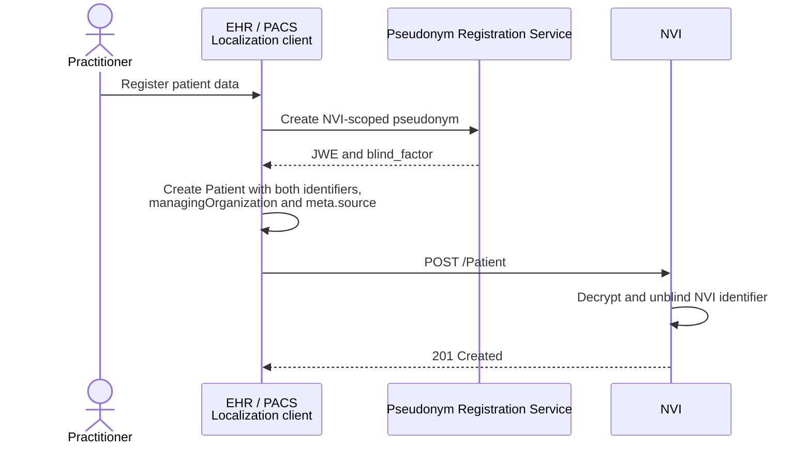
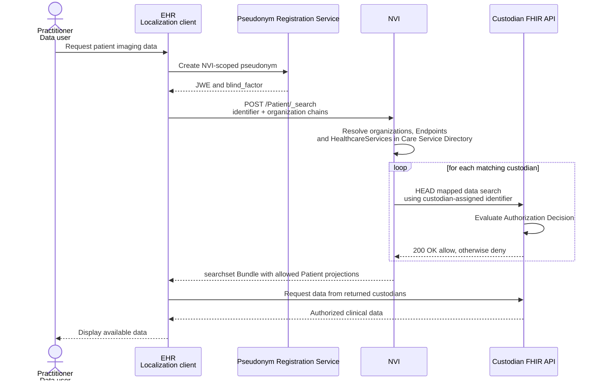

Generic Function Localization enables healthcare professionals to find care providers (custodians) that hold relevant data for a patient. The Data Localization Index or, in Dutch, Nationale Verwijs Index (NVI) stores one `Patient` resource per patient and custodian. A data user searches by the patient's NVI pseudonym and optional custodian properties, and receives only custodians that return an allow Authorization Decision.
{: .ig-lead}

### Solution overview

Custodians first register patients whose data they manage:

1. The custodian obtains the encrypted PRS result and blinding factor for an NVI-scoped pseudonym from the [Pseudonym Registration Service (PRS)](./pseudonymisation.html).
2. The custodian registers a `Patient` resource for that patient and custodian at the NVI.


<!--  -->

A data user can then discover relevant custodians:

1. The data user determines the custodian search criteria and data categories relevant to the care need.
2. The data user obtains the encrypted PRS result and blinding factor for the patient's NVI-scoped pseudonym from the PRS.
3. The data user queries the NVI for the patient, specifying which custodians are relevant by properties such as care provider ID (URA), care provider type, Endpoint payload type, or healthcare-service type.
4. The NVI selects relevant custodians by matching the query against its local [Care Service Directory replica](./csd.html#lrza-directory).
5. For each selected custodian, the NVI requests an Authorization Decision. The NVI returns only custodians with an allow Authorization Decision.
6. The data user discovers the custodians' data Endpoints through the Care Service Directory and requests data directly from them. Custodians authorize each data request independently.


<!--  -->

### Components (actors)

#### Data Localization Index - Nationale Verwijs Index (NVI)

The Data Localization Index or Nationale Verwijs Index (NVI) manages `Patient` resources and MUST implement these [FHIR capabilities](./CapabilityStatement-nl-gf-localization-repository-patient.html).
These FHIR capabilities cover support for [use case: Registering a patient](#use-case-registering-a-patient) and [use case: Retrieving registrations by client](#use-case-retrieving-registrations-by-localization-client).

When a data user searches (like in [use case: Searching for imaging data](#use-case-searching-for-imaging-data)), the NVI SHALL:
1. find `Patient` resources matching the NVI patient identifier;
1. apply any managing-organization filters by resolving the custodian ID against its Care Service Directory replica;
1. request an [Authorization Decision](#authorization-decision) from each matching custodian;
1. return only `Patient` search results for which the decision is allow, omitting all `Patient.identifier` values and `meta.source`;
1. log the search (see [Logging and transparency](#logging-and-transparency)).

The response SHALL NOT reveal whether a custodian was omitted because it had no matching record, did not match the search context, received a deny decision, or could not be reached.

##### Authorization Decision

For each matching custodian and requested data category, the NVI sends a `HEAD` request to the custodian's existing FHIR API. The custodian evaluates whether the data user may access matching data:

```
HEAD [fhir-base-url]/[fhir-resourcetype]?patient.identifier=[custodian-assigned identifier]
```

- `[fhir-base-url]`: the address of an active, in-period `hl7-fhir-rest` Endpoint in the Care Service Directory replica. When custodian Endpoint payload types is specified, the Endpoint's `payloadType` SHALL match at least one of these types.
- `[fhir-resourcetype]`: the FHIR resource type and search parameters mapped to the requested category by the [NL GF Data Categories CodeSystem](./CodeSystem-nl-gf-data-categories-cs.html), such as `MedicationDispense`, `MedicationAdministration`, `MedicationStatement`, and `Immunization` for code `MedicationUse`. If no data category is specified, the resource type `Patient` is used.
- `[custodian-assigned identifier]`: the custodian-assigned patient identifier in the Patient.

For a resource type of `Patient`, use `HEAD [fhir-base-url]/Patient?identifier=[custodian-assigned identifier]` instead of `patient.identifier`.

The request carries an access token whose `authorization_details` identifies the care provider and practitioner acting as the data user. The NVI is the acting party (the OAuth client). See [Authentication and Authorization](#authentication-and-authorization).

Example:

```
HEAD https://fhir.datahouder-123.example/fhir/ImagingStudy?patient.identifier=https://fhir.datahouder-123.example/identifier/patient|9fd244dc-6b35-4a7d-843d-ac77591cb14d HTTP/1.1
Authorization: Bearer [access-token]
```

The NVI interprets the HTTP status of the response as follows:

| HTTP status | Authorization Decision | Result |
|---|---|---|
| `200 OK` | Allow | Custodian is included for this data category |
| `204 No Content` | Deny | Custodian is not included |
| Any other status or timeout | Deny | Custodian is not included |

Processing rules:
- The NVI SHALL group requests by custodian and custodian-assigned identifier, and send one request per resource type mapped to each requested data category. If a category maps to multiple resource types, it is allowed when at least one decision is allow.
- The NVI SHALL perform requests in parallel and with a timeout. A timeout is deny.
- The NVI SHALL NOT send the BSN, NVI pseudonym, or broader search context to the custodian; only the requested data category may be implied by the resource type.
- Decisions SHALL only be used for the current search and SHALL NOT be cached.

An allow decision does not replace authorization of the actual data request. The custodian authorizes every subsequent request because access policies can change.

#### Pseudonym Registration Service
The Pseudonym Registration Service (PRS) provides OPRF evaluations used by clients to derive recipient-scoped pseudonyms from patient identifiers using HKDF and OPRF protocols. See [GF Pseudonymization](./pseudonymisation.html) for the full specification and the [reference implementation](https://github.com/minvws/gfmodules-nationale-verwijsindex-registratie-service/blob/main/test_flow/OPRF.py).


#### Localization client

A Localization Client registers and maintains a Patient resource for each patient and custodian through direct FHIR REST interactions.

The Localization Client MUST support `POST`, and `DELETE` on Patient resources.

##### Registration
Each registered Patient SHALL contain:
- the PRS-created NVI pseudonym in `identifier` with system `http://generiekefuncties.nl/nvi/identifier`;
- the custodian-assigned Patient identifier, with the custodian as its `Identifier.assigner`;
- the custodian's ID in `managingOrganization.identifier`;
- the registering OAuth `client_id` represented as a URI in `meta.source`, using the form `urn:generiekefuncties:nvi:client-id:{client_id}`.

The custodian-assigned identifier SHALL be accepted as the `patient` search value at the custodian's FHIR Endpoint.

**Pseudonymization Integration**: Before submitting localization records, the client MUST compose a pseudonymized patient identifier using the [Pseudonym Registration Service (PRS)](./pseudonymisation.html). When the pseudonym is forwarded to the NVI, the client packages the JWE and `blind_factor` together as a base64url-encoded JSON object:

```json
{
  "evaluated_output": "<JWE compact serialization>",
  "blind_factor": "<base64url-encoded blind_factor>"
}
```

The client places this object, base64url-encoded, in the NVI `Patient.identifier` value. The NVI decrypts and unblinds it before storing the resulting pseudonym.

Use direct `POST [base]/Patient` to register the resource. See the [Patient example](./Patient-nl-gf-localization-patient-example.html).

##### Search
The client SHALL search for Patient resources using `POST [base]/Patient/_search` with `Content-Type: application/x-www-form-urlencoded`, so the patient pseudonym and search context are not exposed in URLs or access logs. The `identifier` parameter SHALL identify the NVI pseudonym. It MAY be combined with these standard chained searches:

- `organization:identifier`: custodian Organization identifier, such as a URA;
- `organization.type`: custodian Organization type;
- `organization.endpoint.payload-type`: payload type of an Endpoint belonging to the custodian;
- `organization._has:HealthcareService:organization:service-type`: type of a HealthcareService provided by the custodian.

`organization:identifier` uses the standard reference `:identifier` modifier. The remaining filters use standard chained or reverse-chained parameters. The NVI SHALL resolve the `managingOrganization` URA against its Care Service Directory replica when evaluating these chains.

Search parameters are combined with AND; comma-separated values within a parameter are combined with OR. The data user is identified from the access token's `authorization_details` object, never from search parameters.

Example: a patient held by any of custodian ids `123`, `456`, `789`, or `012`, where the care provider is type `8610`, has an Endpoint supporting `medicationRequest`, and provides cardiology services:
```
POST [base]/Patient/_search HTTP/1.1
Authorization: [localization client access token]
Content-Type: application/x-www-form-urlencoded

identifier=http://generiekefuncties.nl/nvi/identifier|{NVI-patient-identifier}
&organization:identifier=urn:oid:2.16.528.1.1007.3.3|123,urn:oid:2.16.528.1.1007.3.3|456,urn:oid:2.16.528.1.1007.3.3|789,urn:oid:2.16.528.1.1007.3.3|012
&organization.type=https://www.cbs.nl/standaard-bedrijfsindeling|8610
&organization.endpoint.payload-type=http://fhir.generiekefuncties.nl/csd/CodeSystem/nl-gf-data-categories-cs|medicationRequest
&organization._has:HealthcareService:organization:service-type=http://fhir.generiekefuncties.nl/csd/CodeSystem/nl-gf-zorgvragen-cs|msz.cardiologie
```

`{NVI-patient-identifier}` is the base64url-encoded PRS object described under [Registration](#registration). The NVI decrypts and unblinds it to find matching Patient resources.

The data-user search operation returns a `Bundle` of type `searchset` containing Patient projections for custodians that match the search context and received an allow decision. These projections are marked with the `SUBSETTED` tag. For privacy, the NVI omits all `Patient.identifier` values and `meta.source`; the projections are not complete instances of the registration profile and SHALL NOT be used to update registrations.

**Example Search Response**:
```json
{
  "resourceType": "Bundle",
  "type": "searchset",
  "total": 1,
  "entry": [
    {
      "fullUrl": "https://nvi.example.org/fhir/Patient/9b6e3c1a-2f4d-4c8e-9a71-5d0f3b2e7c44",
      "resource": {
        "resourceType": "Patient",
        "id": "9b6e3c1a-2f4d-4c8e-9a71-5d0f3b2e7c44",
        "meta": {
          "tag": [
            {
              "system": "http://terminology.hl7.org/CodeSystem/v3-ObservationValue",
              "code": "SUBSETTED"
            }
          ]
        },
        "managingOrganization": {
          "identifier": {
            "system": "urn:oid:2.16.528.1.1007.3.3",
            "value": "123"
          }
        }
      },
      "search": {
        "mode": "match"
      }
    }
  ]
}
```


#### Custodian

A custodian exposes its data through a FHIR API registered in the [Care Service Directory](./csd.html). For an Authorization Decision, it SHALL:
- support `HEAD` requests on the relevant FHIR search interactions at the Endpoint registered for each data category;
- evaluate the request using the data user's authorization policy, including consent or access restrictions;
- return `200 OK` only for an allow decision, and `204 No Content` or any other status for deny. Status `204 No Content` is preferred over any other status, because it reveals minimal information to the NVI;
- accept an access token that identifies the data user and has the NVI as acting party;
- log the request and response (authorization decision).

The custodian uses the custodian-assigned identifier to identify the patient.

### Data models

#### Data Localization Patient profile

The [NL GF Data Localization Patient profile](./StructureDefinition-nl-gf-localization-patient.html) uses one Patient resource per patient and custodian:
- `Patient.identifier` contains the NVI pseudonym and a custodian-assigned patient identifier;
- `Patient.managingOrganization` identifies the custodian by URA (OID 2.16.528.1.1007.3.3);
- `Patient.meta.source` identifies the registering OAuth client.

The custodian-assigned identifier SHALL be unique within the custodian's identifier namespace and accepted by its FHIR Endpoint as the patient search value. It SHALL NOT be the BSN and SHOULD NOT be derivable from the BSN. The NVI stores it to request Authorization Decisions from that custodian. It SHALL NOT return it in data-user search responses, but MAY return it to the authorized registering Localization Client for record maintenance.

#### Search context

The search context (zoekcontext) consists of properties of custodians that are relevant to the data user. The following properties are supported:

| Search context | FHIR search parameter | Evaluated against |
|---|---|---|
| Patient | `identifier` | NVI identifier system and PRS pseudonym |
| Custodian organization | `organization:identifier` | Care Service Directory `Organization.identifier` |
| Organization type | `organization.type` | Care Service Directory `Organization.type` |
| Endpoint data category | `organization.endpoint.payload-type` | Care Service Directory Endpoint `payloadType` |
| Healthcare-service type | `organization._has:HealthcareService:organization:service-type` | Care Service Directory HealthcareService `type` and `providedBy` |

FHIR R4 defines these standard search parameters and chained paths. The NVI SHALL support the listed paths and resolve `managingOrganization` identifiers against the Care Service Directory replica.


#### Authentication and Authorization
See [GF Pseudonymisation](./pseudonymisation.html) for PRS authentication requirements.

When searching, the Localization Client's access token SHALL include care provider and practitioner details in the `authorization_details` object (as required for EU-cross-border exchange by [EHDS Implementing Act 2026/2099, Annex 1](https://eur-lex.europa.eu/eli/reg_impl/2026/2099/oj/eng#anx_1))

For an [Authorization Decision](#authorization-decision), the care provider and practitioner details are, again, in the `authorization_details` object, but now the NVI is the acting party (the OAuth client).
For other authentication, transport-layer and access-token details, see GF Authentication.


### Logging and transparency

- The NVI SHALL log each search: timestamp, data-user identifiers, NVI pseudonym, search context, candidate custodians, Authorization Decisions, and returned custodians.
- The custodian SHALL log each Authorization Decision (see [Custodian](#custodian)).
- Search context is visible in the log and may be shown to the patient.

### Privacy and security considerations

- **Disclosure to custodians**: an Authorization Decision reveals that the data user is seeking data about a patient. Requests are limited to custodians matching the search context.
- **Patient identifier privacy**: the NVI sends the custodian-assigned identifier only to its custodian for Authorization Decision requests and SHALL NOT include it in search responses to data users. The custodian does not receive the BSN, NVI pseudonym, or broader search context.
- **No reason leakage**: the NVI returns only allowed Patient projections and does not reveal whether a custodian was absent, filtered out, denied, or unreachable.
- **Fail closed**: every Authorization Decision other than `200 OK`, including timeouts, is deny.


### Example Use Cases

#### Use case: Registering a patient

A custodian registers a Patient resource for each patient it holds. The NVI identifier carries the PRS result envelope; the resource also contains the custodian-assigned identifier, the custodian ID, and the registering OAuth client URI.




#### Use case: Searching for imaging data

Dr. Smith's EHR searches for a patient's imaging data at organizations offering cardiology services. The NVI uses the patient pseudonym and search context to select candidates, then returns only custodians with an allow decision.




#### Use case: Retrieving registrations by Localization client

```
GET [base]/Patient?_source=urn:generiekefuncties:nvi:client-id:ehr-client-org2
```

The NVI returns a `searchset` Bundle of matching Patient resources to the authorized registering Localization client for record maintenance. This maintenance interaction is separate from data-user search responses, which SHALL NOT include the custodian-assigned identifier.


### Roadmap for GF Localization

#### NVI
Potential future enhancements to the NVI include:
- Audit logging capabilities (MUST HAVE, TODO)

#### Open issues
- Token profile for the NVI acting on behalf of the data user, aligned with GF Authentication and GF Authorization.
- Minimum specificity of a search context.
- Timeout values for Authorization Decisions.
- A CapabilityStatement for custodians, specifying `HEAD` support and Authorization Decision responses.
- Specifying Authorization Decision mechanisms for for-FHIR API's or data categories (e.g. DICOM)
