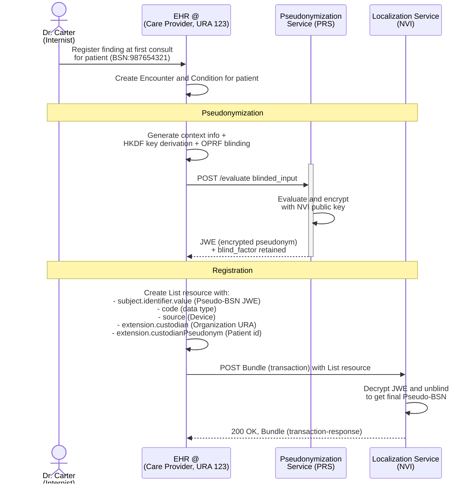
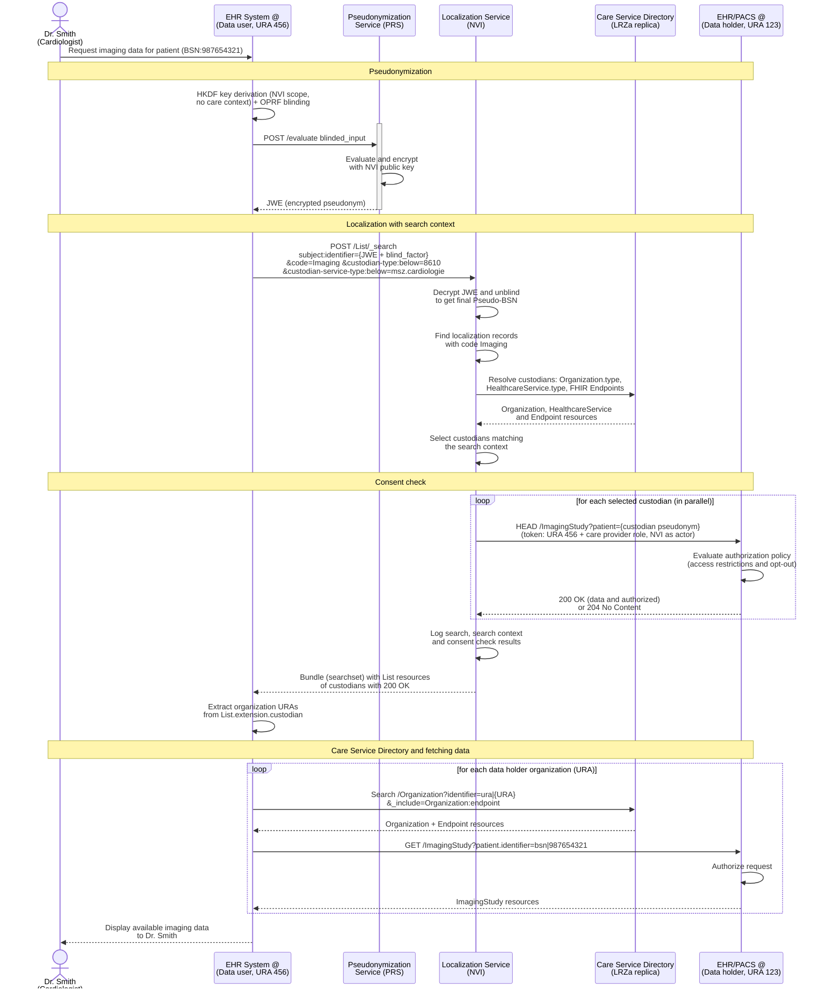

Patient data is often divided over multiple data holders. Generic Function Localization provides a standardized framework that enables healthcare professionals to discover which organizations hold relevant patient data of a specific type.
{: .ig-lead}

### Solution overview

GF-Localization is based on the IHE [MHD profile](https://profiles.ihe.net/ITI/MHD/) and follows the choices made by the MinvWS Localization working group, see [GF-Lokalisatie, ADR's](https://github.com/orgs/minvws/projects/70/views/1). This guide specifies the choices made. Most impactful/striking choice are:

- using one national Medical Record Localization Service: the 'Nationale Verwijs Index' (NVI)
- using one national service for pseudonymizing citizen service numbers (BSN's): the [Pseudonymization Service](./pseudonymisation.html)
- using IHE [MHD profile](https://profiles.ihe.net/ITI/MHD/) to publish and find Localization records (transactions [ITI-65](https://profiles.ihe.net/ITI/MHD/ITI-65.html) and [ITI-66](https://profiles.ihe.net/ITI/MHD/ITI-66.html)). As a pseudonimization service is used, the FHIR profiles and transactions are compatible with the IHE MHD profile, but not directly compliant. 
- a data user searches with a [search context](#search-context) (zoekcontext): properties of the data holders that are relevant to the data user, instead of a care context (zorgcontext) in the pseudonym
- the NVI only discloses a data holder after a [consent check](#consent-check) (toestemmingscheck) at that data holder, using a HEAD request on the existing FHIR API of the data holder

Here is a brief overview of the processes that are involved: 
1. Every data holder registers the presence of data concerning a specific patient and data category at the Localization service, together with its own pseudonym for that patient (custodian pseudonym).
1. A data user (practitioner and/or system (EHR)) searches the Localization service for a specific patient, using a search context.
1. The Localization service selects the data holders that match the search context and checks at each of them whether the data user is allowed access (consent check). Only data holders that pass the consent check are returned to the data user.


These processes require the use of pseudonyms generated by the national [Pseudonymization Service (PRS)](./pseudonymisation.html). The Localization service-response provides a list of data holders; the endpoints of these data holders (e.g. FHIR or DICOM-urls) need to be resolved using a [Care service (Query) Directory](./csd.html#lrza-directory). This process is illustrated in [this example](./csd.html#use-case-4-endpoint-discovery). 


The figure does not show the consent check: as part of step 2, the Localization Service sends a consent check to the data sources that match the search context.

For more detail on the topology of GF-Localization, see [GF-Lokalisatie, ADR-2](https://github.com/minvws/generiekefuncties-lokalisatie/issues/15). Each component, data model, and transaction will be discussed in more detail.

#### Search context and consent check

GF-Localization protects the privacy of patients and respects their consent with the following principles:

1. **No care context in the PRS pseudonym.** The data user derives the PRS pseudonym for the NVI with `recipient_scope = nationale-verwijsindex`, without a care context (e.g. data category or care setting). Selection by context is done with an explicit search context that is logged and visible to citizens, instead of a care context that is hidden in the pseudonym.
2. **The data user sends a search context.** The search context consists of properties of data holders, taken from the [Care Service Directory (LRZa)](./csd.html): data category (`Endpoint.payloadType`), organization identifier (URA), `Organization.type` and/or `HealthcareService.type`. A search context can be much more specific than a care context, but it describes *care provider* properties, not patient or record properties. Because the search context is logged, an overly broad search context can lead to critical questions from citizens.
3. **The NVI selects, the data holder decides.** The NVI uses the search context to select the relevant data holders. For each selected data holder, the NVI performs a consent check using the URA and the care provider role (zorgverlenerrol) of the data user. Following EHDS Implementing Act 2026/2099 (21 September 2026), the care provider role is part of the A&A memo. Evaluating access restrictions and opt-out (the EHDS terms for consent) is the responsibility of the data holder.
4. **Only remaining data holders are returned.** The NVI returns only the data holders that remain after the search context selection *and* the consent check.

### Components (actors)

#### Localization Service

A (Medical Record) Localization Service is responsible for managing the registration, maintenance, and publication of localization records. It should be able to create and update localization records. A Localization Service MUST implement these [FHIR capabilities](./CapabilityStatement-nl-gf-localization-repository-list.html)

When a data user searches for localization records of a patient, the Localization Service SHALL:
1. find the localization records of the patient that match the data categories (`code`) of the [search context](#search-context);
1. select the custodians of these records that match the other search context properties, using its replica of the [Care Service Directory (LRZa)](./csd.html#lrza-directory);
1. perform a [consent check](#consent-check) at each selected custodian;
1. return only the localization records of custodians that pass the consent check, without `subject` and without the custodian pseudonym;
1. log the search (see [Logging and transparency](#logging-and-transparency)).

The response SHALL NOT reveal whether a custodian was left out because it had no matching localization record, because it did not match the search context, because the consent check was negative, or because of an error.

##### Consent check

The Localization Service checks at each selected custodian whether data of the requested data category is available that the data user is allowed to access. To this end, it sends a HEAD request to the existing FHIR API of the custodian, so that custodians do not need to implement a new API:

```
HEAD [fhir-base-url]/[fhir-resourcetype]?patient=[custodian pseudonym]
```

- `[fhir-base-url]`: the `address` of the FHIR Endpoint of the custodian in the LRZa replica. The Localization Service selects this Endpoint in the same way as a data user would (see [Query Client](./csd.html#query-client)): status `active`, `period` including the current time, `connectionType` `hl7-fhir-rest` and a `payloadType` equal to the data category.
- `[fhir-resourcetype]`: the FHIR resource type, including search parameters if present, that is mapped to the data category of the search context by the property `fhir-resourcetype-params` of the [NL GF Data Categories CodeSystem](./CodeSystem-nl-gf-data-categories-cs.html). For example: `Imaging` maps to `ImagingStudy`, and `ObservationLaboratory` maps to `Observation?category=http://terminology.hl7.org/CodeSystem/observation-category|laboratory`.
- `[custodian pseudonym]`: the [custodian pseudonym](#custodian-pseudonym) of the localization record.

The request carries an access token in which the data user (URA and care provider role) is the subject and the Localization Service is the acting party (see [Authentication and Authorization](#authentication-and-authorization)). The custodian thus evaluates the request with the same authorization policy as a request of the data user itself.

Example:

```
HEAD https://fhir.datahouder-123.example/fhir/ImagingStudy?patient=3f9c2a7e-8b41-4d6a-9c1e-5b7d2f0a6e13 HTTP/1.1
Authorization: Bearer {access token: data user URA 456 and care provider role, Localization Service as actor}
```

The Localization Service interprets the HTTP status of the response as follows:

| HTTP status | Meaning | Result |
|---|---|---|
| `200 OK` | Data is available and the data user is authorized to access it | Custodian is returned for this data category |
| `204 No Content` | There is no data, or the data user is not authorized to access it | Custodian is not returned for this data category |
| Any other status, or no response within the timeout | Technical error | Custodian is not returned for this data category (fail closed) |

Processing rules:
- The Localization Service SHALL group the matched localization records per custodian, data category and custodian pseudonym, and send one HEAD request per resource type mapped to the data category. When a data category maps to multiple resource types (e.g. `MedicationUse`), the data category passes when at least one HEAD request returns `200 OK`. For the resource type `Patient`, the search parameter `_id` is used instead of `patient`.
- The Localization Service SHALL perform the consent checks in parallel and with a timeout.
- The Localization Service SHALL NOT send the BSN, the NVI pseudonym or the search context to the custodian, other than the data category implied by the resource type.
- The Localization Service SHALL NOT cache the results of consent checks beyond the search for which they were performed, as consent may change at any time.

The consent check does not replace the authorization of the actual data request: the data holder authorizes every data request of the data user, as consent may change between localization and data retrieval.

#### Pseudonymization Service
The Pseudonymization Service (PRS) is responsible for creating recipient-scoped pseudonyms of patient identifiers using HKDF and Oblivious Pseudorandom Function (OPRF) protocols. See [GF Pseudonymisation](./pseudonymisation.html) for the full specification.


#### Localization client

A Localization Client is responsible for registering and managing localization records at the Localization Service on behalf of healthcare organizations. The client is typically embedded within or integrated with Electronic Health Record (EHR) systems, Picture Archiving and Communication Systems (PACS), or other clinical systems that manage patient data.

The Localization Client MUST support the following capabilities:

##### Registration of Localization Records
The client SHALL be able to create and register List resources (localization records) at the Localization Service. The client MUST support Bundle transactions to register localization records:
- Create FHIR Bundle resources of type `transaction`
- Include List resources (localization records) as Bundle entries with appropriate HTTP methods (POST for create, DELETE for remove). Updates are not supported; to correct a record, delete it and create a new one.
- Submit the Bundle to the Localization Service's transaction endpoint
- Handle transaction responses, including success confirmations and error conditions

**Pseudonymization Integration**: Before submitting localization records, the client MUST compose a pseudonymized patient identifier using the [Pseudonymization Service (PRS)](./pseudonymisation.html). When the pseudonym is forwarded to the NVI, the client packages the JWE and `blind_factor` together as a base64url-encoded JSON object:

```json
{
  "evaluated_output": "<JWE compact serialization>",
  "blind_factor": "<base64url-encoded blind_factor>"
}
```

This object is used in the `subject.identifier.value` element (using the system `http://generiekefuncties.nl/nvi/identifier`).

**Data Holder Identification**: The client MUST include the appropriate organization identifier (URA) in the nl-gf-localization-custodian extension of each localization record to identify the data holder/custodian.

**Custodian Pseudonym**: The client MUST include the [custodian pseudonym](#custodian-pseudonym) of the patient in the nl-gf-localization-custodian-pseudonym extension of each localization record. The Localization Service uses this value in the [consent check](#consent-check).

**Example Bundle Transaction**:
For more information on the content, see the paragraph on [Localization record](#localization-record)

```json
{
  "resourceType": "Bundle",
  "id": "nvi-org1",
  "entry": [
    {
      "request": {
        "method": "POST",
        "url": "List"
      },
      "resource": {
        "resourceType": "List",
        "extension": [
          {
            "valueReference": {
              "identifier": {
                "system": "urn:oid:2.16.528.1.1007.3.3",
                "value": "11111111"
              }
            },
            "url": "http://fhir.generiekefuncties.nl/csd/StructureDefinition/nl-gf-localization-custodian"
          },
          {
            "valueId": "3f9c2a7e-8b41-4d6a-9c1e-5b7d2f0a6e13",
            "url": "http://fhir.generiekefuncties.nl/csd/StructureDefinition/nl-gf-localization-custodian-pseudonym"
          }
        ],
        "subject": {
          "identifier": {
            "system": "http://generiekefuncties.nl/nvi/identifier",
            "value": "eyJldmFsdWF0ZWRfb3V0cHV0IjoiSldFX0ZST01fUFJTIiwiYmxpbmRfZmFjdG9yIjoiQ0xJRU5UX0dFTl9CTElORF9GQUNUT1IifQ"
          }
        },
        "source": {
          "identifier": {
            "system": "http://generiekefuncties.nl/nvi/client-id",
            "value": "ehr-client-org2"
          }
        },
        "status": "current",
        "mode": "working",
        "emptyReason": {
          "coding": [
            {
              "code": "withheld",
              "system": "http://terminology.hl7.org/CodeSystem/list-empty-reason"
            }
          ]
        },
        "code": {
          "coding": [
            {
              "code": "MedicationRequest",
              "system": "http://fhir.generiekefuncties.nl/csd/CodeSystem/nl-gf-data-categories-cs",
              "display": "Medication Request"
            }
          ]
        }
      }
    }
  ],
  "type": "transaction"
}
```

##### Search for Localization Records
The client SHALL support searching for List resources (localization records). This enables healthcare professionals to discover which organizations hold relevant patient data. The Localization Client SHALL support the following search parameters:

- **subject:identifier**: Search for localization records by pseudonymized patient identifier (BSN)
- **code**: Search for localization records by data category (part of the [search context](#search-context))
- **custodian**: Search for localization records by the identifier (URA) of the data holder (part of the search context)
- **custodian-type**: Search for localization records by the `Organization.type` of the data holder, supporting the `:below` modifier (part of the search context)
- **custodian-service-type**: Search for localization records by the `HealthcareService.type` of the data holder, supporting the `:below` modifier (part of the search context)
- **source:identifier**: Search for localization records registered by an application.  

Client SHALL either use the subject:identifier or source:identifier in a search.

When searching by `subject:identifier`, the client:
- SHALL use `POST [base]/List/_search` with `Content-Type: application/x-www-form-urlencoded`, so that the pseudonym and the search context do not end up in URLs, proxy logs or access logs;
- SHALL include a search context with at least one `code`;
- SHOULD use the narrowest search context that fits the care need, as the search context is logged and can be shown to the patient.

Different search parameters are combined with AND; comma-separated values within one search parameter are combined with OR (standard FHIR search semantics). The Localization Service takes the URA and care provider role of the data user from the access token, never from search parameters.

**Example Search Query**: imaging data at hospitals offering cardiology services (shown unencoded and split over lines for readability):
```
POST [base]/List/_search HTTP/1.1
Authorization: Bearer {access token of data user: URA 456 and care provider role}
Content-Type: application/x-www-form-urlencoded

subject:identifier=http://generiekefuncties.nl/nvi/identifier|{nvi-patient-identifier}
&code=http://fhir.generiekefuncties.nl/csd/CodeSystem/nl-gf-data-categories-cs|Imaging
&custodian-type:below=https://www.cbs.nl/standaard-bedrijfsindeling|8610
&custodian-service-type:below=http://fhir.generiekefuncties.nl/csd/CodeSystem/nl-gf-zorgvragen-cs|msz.cardiologie
```

`{nvi-patient-identifier}` is the base64url-encoded object described in [Registration of Localization Records](#registration-of-localization-records). The `:below` modifier also matches more specific codes, e.g. SBI `86102` (general hospital care). A data user who knows the relevant data holders (e.g. the referring hospital) uses `custodian=urn:oid:2.16.528.1.1007.3.3|123,urn:oid:2.16.528.1.1007.3.3|789` instead of, or in addition to, `custodian-type` and `custodian-service-type`.

The search operation returns a Bundle of type `searchset` containing one List resource per data holder and data category that matches the search context and passed the [consent check](#consent-check), allowing the client to identify which data holders have specific types of patient data.  
This response will not contain the (pseudomized) subject.identifier nor the custodian pseudonym for privacy/security reasons.

**Example Search Response**:
```json
{
  "resourceType": "Bundle",
  "type": "searchset",
  "total": 1,
  "entry": [
    {
      "fullUrl": "https://nvi.example.org/fhir/List/9b6e3c1a-2f4d-4c8e-9a71-5d0f3b2e7c44",
      "resource": {
        "resourceType": "List",
        "id": "9b6e3c1a-2f4d-4c8e-9a71-5d0f3b2e7c44",
        "extension": [
          {
            "url": "http://fhir.generiekefuncties.nl/csd/StructureDefinition/nl-gf-localization-custodian",
            "valueReference": {
              "identifier": {
                "system": "urn:oid:2.16.528.1.1007.3.3",
                "value": "123"
              }
            }
          }
        ],
        "status": "current",
        "mode": "working",
        "code": {
          "coding": [
            {
              "system": "http://fhir.generiekefuncties.nl/csd/CodeSystem/nl-gf-data-categories-cs",
              "code": "Imaging"
            }
          ]
        },
        "emptyReason": {
          "coding": [
            {
              "system": "http://terminology.hl7.org/CodeSystem/list-empty-reason",
              "code": "withheld"
            }
          ]
        }
      },
      "search": {
        "mode": "match"
      }
    }
  ]
}
```


##### Pseudonymization Integration

For detailed OPRF integration requirements, see [GF Pseudonymisation](./pseudonymisation.html) and the [reference implementation](https://github.com/minvws/gfmodules-nationale-verwijsindex-registratie-service/blob/main/test_flow/OPRF.py).


#### Data holder

A data holder (custodian) offers patient data through a FHIR API that is registered as Endpoint in the [Care Service Directory (LRZa)](./csd.html). To support the [consent check](#consent-check), the data holder:
- SHALL support HEAD requests on the search interactions of the FHIR resource types that are mapped to the data categories it registers, at the Endpoint that is registered in the LRZa for these data categories;
- SHALL evaluate a HEAD request with the same authorization policy as a GET request of the data user, including access restrictions and opt-out (e.g. Mitz, local consents and implicit consents). The data holder can look up the BSN of the patient for a Mitz check using the custodian pseudonym;
- SHALL respond with `200 OK` when at least one matching resource exists and the data user is authorized to access it;
- SHALL respond with `204 No Content` when no matching resource exists, *or* when the data user is not authorized. The data holder SHALL NOT use other status codes (e.g. `403` or `404`) to distinguish between these two situations;
- SHALL only accept an access token in which a party acts on behalf of a data user when that acting party is the Localization Service;
- SHALL log each consent check (URA and care provider role of the data user, resource type and result), so that it can be included in the access information for the patient.

A data holder can implement this in front of an existing FHIR API without changing it, e.g. in an API gateway or policy enforcement point that executes the search with `_summary=count` and responds with `200 OK` when the total is greater than zero. Note that a plain FHIR search returns `200 OK` with an empty Bundle when there are no results; the `204 No Content` response is a specific requirement of this guide.

### Data models

#### Localization record

Within GF-Localization the [NL-gf-localization-List profile](./StructureDefinition-nl-gf-localization-list.html) is used to register, search, and validate localization records ([NL-GF-IG, ADR#10](https://github.com/nuts-foundation/nl-generic-functions-ig/issues/10)).
This data model basically states ***"Care provider X has data of type Y for Patient Z"***. It contains the following elements:
- **Custodian identifier**: The care provider identifier (URA) representing the data holder/custodian.
- **Custodian pseudonym**: The [pseudonym of the patient at the custodian](#custodian-pseudonym), used by the Localization Service for the consent check.
- **Patient identifier**: The NVI identifier to identify the patient in the NVI.
- **Code**: Represents type of data stored at the data holder/custodian (required binding to [NL-GF Zorgcontext Types](./ValueSet-nl-gf-zorgcontext-vs.html).
- **Source identifier**: The OAuth client identifier (`client_id`) of the specific software installation (e.g., EHR deployment) that registered this localization record. 
- **emptyReason**: The `emptyReason` is set to withheld because this List signals the existence of data at a custodian, without enumerating the actual records. The List resource is used as a localization pointer, not as a container for document references

A [Location record example](./List-a1b2c3d4-e5f6-7890-abcd-ef1234567890.html) is in the IG artifacts.

#### Custodian pseudonym

The custodian pseudonym (bronhouder-pseudoniem) is registered in the [nl-gf-localization-custodian-pseudonym extension](./StructureDefinition-nl-gf-localization-custodian-pseudonym.html). It enables the Localization Service to perform the [consent check](#consent-check) without knowing the identity of the patient. The custodian pseudonym:
- SHALL be a value that the FHIR Endpoint of the custodian, registered in the LRZa for the data category of the localization record, accepts as value of the `patient` search parameter. Typically, this is the logical id of the Patient resource at that Endpoint;
- SHALL NOT be the BSN, and SHOULD NOT be derivable from the BSN or the local patient number without a secret that only the custodian holds (e.g. a UUID, or a keyed hash of the local patient number). An unkeyed hash of a BSN can be reversed by trying all possible values;
- SHOULD be the same for all localization records of a patient at the same Endpoint, so that the Localization Service needs as few consent checks as possible;
- SHALL be replaced (delete and create the localization record) when it changes, e.g. after a patient merge or a migration to another system.

The Localization Service SHALL store the custodian pseudonym, SHALL only send it to the custodian identified in the same localization record, and SHALL NOT return it in search results.

#### Search context

The search context (zoekcontext) consists of properties of data holders that are relevant to the data user. The following properties are supported:

| Property | Search parameter | Source | Evaluated by the Localization Service against | Example (system, code) |
|---|---|---|---|---|
| Data category (required) | `code` | LRZa `Endpoint.payloadType`, same code system as `List.code` | `List.code`, and a valid FHIR Endpoint of the custodian with this `payloadType` | `http://fhir.generiekefuncties.nl/csd/CodeSystem/nl-gf-data-categories-cs`, `Imaging` |
| Data holder organization | [`custodian`](./SearchParameter-nl-gf-localization-list-custodian.html) | LRZa `Organization.identifier` | The custodian extension of the List | `urn:oid:2.16.528.1.1007.3.3`, `123` |
| Organization type | [`custodian-type`](./SearchParameter-nl-gf-localization-list-custodian-type.html) | LRZa `Organization.type` | `Organization.type` of the custodian and its child Organizations in the LRZa replica | `https://www.cbs.nl/standaard-bedrijfsindeling`, `8610` (hospital activities) |
| Healthcare service type | [`custodian-service-type`](./SearchParameter-nl-gf-localization-list-custodian-service-type.html) | LRZa `HealthcareService.type` | `HealthcareService.type` of HealthcareServices provided by the custodian or its child Organizations in the LRZa replica | `http://fhir.generiekefuncties.nl/csd/CodeSystem/nl-gf-zorgvragen-cs`, `msz.cardiologie` |

The data categories in the search context also determine the FHIR resource types used in the [consent check](#consent-check).


#### Authentication and Authorization
See [GF Pseudonymisation](./pseudonymisation.html) for PRS authentication requirements.

When searching for localization records, the data user authenticates at the Localization Service with an access token that contains the URA and the care provider role (zorgverlenerrol) of the data user, as defined in the A&A memo.

For the [consent check](#consent-check), the Localization Service uses an access token in which the data user (URA and care provider role) is the subject and the Localization Service is the acting party, e.g. using OAuth 2.0 Token Exchange ([RFC 8693](https://www.rfc-editor.org/rfc/rfc8693), `act` claim). The Localization Service and the data holder SHALL authenticate each other, e.g. using PKIoverheid certificates (mTLS).


### Logging and transparency

- The Localization Service SHALL log per search: timestamp, URA and care provider role of the data user, practitioner identifier (when available), NVI pseudonym, the complete search context, the selected data holders, the results of the consent checks and the returned data holders.
- The data holder SHALL log each consent check (see [Data holder](#data-holder)).
- Because the search context is logged and can be shown to the patient, data users SHOULD use the narrowest search context that fits the care need. A care context in the PRS pseudonym would not be visible in the logging; this is a deliberate difference.

### Privacy and security considerations

- **Disclosure to data holders**: through the consent check, a data holder learns that a data user (URA and care provider role) is looking for data of its patient. This is limited to data holders that already registered data about the patient and that match the search context. This is another reason to keep the search context narrow.
- **Data minimization**: the custodian pseudonym is only sent to the data holder that registered it. Data holders do not receive the BSN, the NVI pseudonym or the search context (other than the data category implied by the resource type).
- **No distinction between absence and denial**: data holders respond `204 No Content` both when there is no data and when access is denied, so the Localization Service cannot distinguish between the two. The Localization Service does not reveal why a data holder is not returned, so the data user cannot derive a consent decision of the patient from the result.
- **Fail closed**: a data holder that cannot be reached, has no valid FHIR Endpoint for the data category, or returns an unexpected status is not returned.


### Example Use Cases

#### Use case: Radiologist registering Imaging Data
**Scenario**: Dr. Carter, a radiologist at a care provider organization, performs an imaging study for a patient. To enable data discovery by other healthcare professionals, Dr. Carter's organization must register the existence of this imaging data in the national localization index (NVI). This process involves pseudonymizing the patient's identifier, creating a localization record, and submitting it to the NVI with the appropriate authorization attributes.

The following diagram illustrates the registration workflow, including interactions between the radiologist, the PACS system and the NVI. For brevity, interactions to the Pseudonymization Service are left out here.





#### Use Case: Cardiologist searching for Imaging Data

**Scenario**: Dr. Smith, a cardiologist at Hospital A, is treating a patient who was recently referred from another hospital. She needs to know what imaging data (X-rays, CT scans, MRIs) might be available from other healthcare providers to avoid unnecessary duplicate examinations and to get a complete picture of the patient's medical history. Her EHR searches for imaging data at hospitals that offer cardiology services (search context). The NVI only returns the hospitals that hold imaging data of the patient and that allow Dr. Smith access.





#### Use Case: Localization Client retrieving all registered localization records

**Scenario**: A healthcare organization needs to retrieve all localization records it has registered in the National Localization Service (NVI). This is useful for administrative purposes, data quality checks, reconciliation, or audit trails. This query retrieves all localization records registered by a specific client/system (the Localization Client)

```
GET [base]/List?source:identifier=http://generiekefuncties.nl/nvi/client-id|ehr-client-org2
```

**Response**: The NVI returns a Bundle of type `searchset` containing all matching List resources registered by the specified organization or client.


### Roadmap for GF Localization

#### Localization Service
Potential future enhancements to the Localization Service include:
- Audit logging capabilities (MUST HAVE, TODO)

#### Open issues for search context and consent check
- Code system for the care provider role (zorgverlenerrol) according to the A&A memo and EHDS Implementing Act 2026/2099.
- Token profile for the Localization Service acting on behalf of the data user in the consent check (token exchange or forwarding the signed A&A memo of the data user), aligned with GF Authentication and GF Authorization.
- Minimum specificity of a search context, and a possible maximum number of data holders per search.
- Timeout values for the consent check.
- A CapabilityStatement for data holders, specifying HEAD support and the `200 OK`/`204 No Content` responses.
- Migration of existing localization records without a custodian pseudonym.
