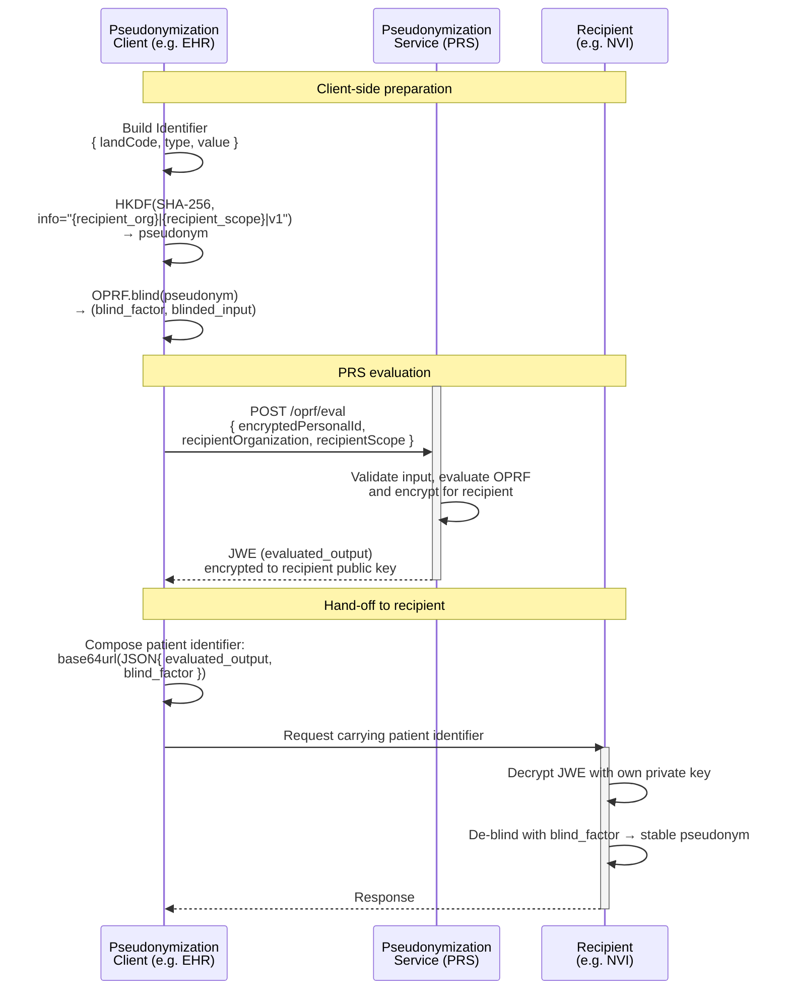

Generic Function Pseudonymisation defines how a national Pseudonym Registration Service (PRS) is used to convert an identifier (e.g. a Burgerservicenummer, BSN) into a recipient-specific, single-use pseudonym. The goal is to allow generic functions such as [GF Localization](./localization.html) to exchange patient-bound information without ever revealing the underlying BSN to the receiving party (e.g. the Nationale Verwijs Index, NVI).
{: .ig-lead}

The PRS combines two cryptographic building blocks:

- an **HKDF** key derivation (RFC 5869) that produces a deterministic but recipient-scoped pseudonym from an `Identifier`;
- an **Oblivious Pseudorandom Function (OPRF)** that lets the client blind its input so the PRS can evaluate it without learning the value.

The PRS returns the evaluation result encrypted as a JWE for the intended recipient. The client never sees the cleartext pseudonym; the recipient never sees the BSN.

### Solution overview

The basic process for obtaining and using a pseudonym is:

1. The Pseudonymization Client constructs an `Identifier` for the patient in JSON Canonicalization Scheme - JCS (RFC8785) e.g. `{"landCode":"NL","type":"BSN","value":"999940003"}`.
2. The client derives a recipient-scoped pseudonym from the `Identifier` using HKDF, using a fixed `info` string that binds the result to the intended recipient.
3. The client applies the OPRF blinding step, producing a `blind_factor` (kept locally) and a `blinded_input` (sent to the PRS).
4. The PRS evaluates the `blinded_input` and returns the result as a JWE (`evaluated_output`) encrypted with the public key of the intended recipient.
5. The client forwards the JWE (`evaluated_output`) together with the `blind_factor` to the recipient as part of a downstream transaction (for example, a [GF Localization](./localization.html) registration or query).
6. The recipient decrypts the JWE with its own private key and de-blinds it with the `blind_factor` to obtain the final, stable pseudonym for that recipient.



For more background on how the result is consumed, see [GF Localization](./localization.html).

### National choices

This guide makes the following national choices for pseudonymisation:

1. **Single national PRS.** All generic functions that need to exchange patient-bound information rely on the same national Pseudonym Registration Service. Recipients (such as the NVI) do not operate their own pseudonymisation infrastructure.
2. **OPRF + HKDF.** Pseudonyms are derived using HKDF with SHA-256 ([RFC 5869](https://www.rfc-editor.org/rfc/rfc5869)) and blinded using an OPRF protocol. The PRS only ever sees blinded values.
3. **Recipient-scoped pseudonyms.** A pseudonym is bound to one specific recipient and scope at derivation time (encoded in the HKDF `info` string). The same identifier therefore yields different pseudonyms for different recipients, preventing cross-service correlation. The scope identifies the recipient service only.
4. **JWE container, single use.** The PRS response is a JWE, opaque to the client, intended for one-time use in a single downstream transaction. Clients SHALL NOT cache or persist the JWE beyond the transaction it was obtained for.
5. **No identifier persistence at PRS.** The PRS does not store identifiers, pseudonyms or links between them.

### Actors

| Actor | Role | Transactions |
|---|---|---|
| [Pseudonymization Client](#pseudonymization-client) | Derives and blinds the pseudonym, and forwards the result to the recipient | Client for [GF-PSD-1](#gf-psd-1-evaluate-blinded-input) |
| [Pseudonym Registration Service (PRS)](#pseudonym-registration-service-prs) | Evaluates the blinded input and encrypts the result for the recipient | Server for [GF-PSD-1](#gf-psd-1-evaluate-blinded-input) |
| [Recipient](#recipient) | Decrypts and de-blinds the result to obtain its pseudonym | Specified by the generic function that uses the pseudonym |

#### Pseudonymization Client

A Pseudonymization Client is typically embedded in or alongside an EHR, PACS, or another generic-function client (e.g. a [Localization Client](./localization.html#localization-client)). The client:

- SHALL construct the `Identifier` from authoritative source data (e.g. the patient's BSN held in the EHR);
- SHALL derive the pseudonym using HKDF with the agreed `info` string for the intended recipient and scope;
- SHALL perform the OPRF blinding locally, with a new random `blind_factor` for each request (see [OPRF blinding](#oprf-blinding)), and keep the `blind_factor` confidential;
- SHALL submit only the `blinded_input` (and the recipient identifiers) to the PRS;
- SHALL forward the resulting JWE together with the `blind_factor` to the recipient as part of a single downstream transaction;
- SHALL NOT log or persist the derived pseudonym, or the `blind_factor` beyond the lifetime of the transaction.

#### Pseudonym Registration Service (PRS)

The PRS is the central national service that evaluates blinded inputs. It uses a key bound to the recipient, and encrypts the result as a JWE with the recipient's public key. The PRS never sees the `Identifier` or the pseudonym, and does not store its input, its output, or any link between them (see [National choices](#national-choices)). Its interface is [GF-PSD-1](#gf-psd-1-evaluate-blinded-input).

#### Recipient

The Recipient is the organization for which the pseudonym is intended. The recipient scope identifies its service. For example, the Ministry of VWS is the recipient organization for the [NVI](./localization.html#nvi). It publishes a public key at the PRS, decrypts the JWE with the corresponding private key, and de-blinds the result with the `blind_factor` to obtain its stable pseudonym. The generic function that uses the pseudonym specifies the recipient's requirements, for example [GF Localization](./localization.html#gf-loc-1-register-patient).

### Transactions

| ID | Transaction | Client | Server |
|---|---|---|---|
| GF-PSD-1 | [Evaluate blinded input](#gf-psd-1-evaluate-blinded-input) | Pseudonymization Client | PRS |

#### GF-PSD-1: Evaluate blinded input

The client sends the `blinded_input` together with identifiers for the intended recipient to the PRS.

**Request.**

```
POST [prs-base-url]/oprf/eval HTTP/1.1
Authorization: [access token]
Content-Type: application/json

{
  "encryptedPersonalId": "<base64url-encoded blinded_input>",
  "recipientOrganization": "oin:<OIN of the Ministry of VWS>",
  "recipientScope": "nationale-verwijsindex"
}
```

- `encryptedPersonalId`: the `blinded_input`, base64url-encoded. Despite its name, this value is blinded, not encrypted;
- `recipientOrganization`: the OIN of the recipient organization, prefixed with `oin:`. For the NVI, this is the Ministry of VWS;
- `recipientScope`: the recipient service for which the recipient registered its public key.

**Response.** `200 OK` with the OPRF evaluation as a JWE encrypted to the recipient's public key:

```
HTTP/1.1 200 OK
Content-Type: application/json

{
  "jwe": "<JWE compact serialization>"
}
```

The pair of this JWE and the `blind_factor` together forms the patient identifier that is passed to the recipient. See [GF Localization — Register Patient](./localization.html#gf-loc-1-register-patient) for how this identifier is represented in `Patient.identifier`, where the JWE is called `evaluated_output`.

**Errors.** The PRS returns a JSON body with a `detail` field that describes the error.

| Status | Cause | Client action |
|---|---|---|
| `400 Bad Request` | The PRS cannot evaluate the blinded input, or `recipientOrganization` does not start with `oin:`. | Correct the request. Do not retry unchanged. |
| `401 Unauthorized` | The access token is missing, expired, or invalid. | Obtain a new token and retry. |
| `403 Forbidden` | The requesting organization is not registered at the PRS, or may not request OPRF pseudonyms. | Do not retry. |
| `404 Not Found` | The recipient is unknown, or has no public key for `recipientScope`. | Check the recipient identifiers. Do not retry unchanged. |
| `409 Conflict` | The PRS has no active key for the recipient. | Retry later. |
| `422 Unprocessable Entity` | The request body is invalid, for example a missing field or a value that is not base64url. | Correct the request. |
| `503 Service Unavailable` | The PRS cannot reach its key store. | Retry later. |

#### Security

- The client SHALL authenticate to the PRS according to GF Authentication: it requests an access token and presents it with each request.
- The access token SHALL carry the scope `prs:oprf-pseudonym`.
- The access token identifies the client organization and the care provider it acts for. The PRS checks that the care provider may request OPRF pseudonyms, and that the recipient may receive them.

### Data model

#### Identifier

The Identifier is a small JSON object that uniquely identifies the natural person being pseudonymized. For example, a Dutch citizen identified by its BSN:

```json
{"landCode":"NL","type":"BSN","value":"999940003"}
```

The Identifier is never sent to the PRS; it is the input to the local HKDF step. This Identifier SHALL be in  JSON Canonicalization Scheme - JCS (RFC 8785).

#### HKDF derivation

The pseudonym handed to OPRF is derived as:

- algorithm: HMAC-SHA-256
- length: 32 bytes
- salt: none
- info: `"{recipient_organization}|{recipient_scope}|v1"`
- input keying material: the UTF-8 JSON serialisation of the Identifier.


#### OPRF blinding

The client SHALL blind the 32-byte HKDF output with the `Blind` function of [RFC 9497](https://www.rfc-editor.org/rfc/rfc9497), OPRF mode (`modeOPRF`), with ciphersuite `ristretto255-SHA512`. This yields two values:

- `blind_factor` — a secret kept by the client and later used by the recipient to de-blind the PRS response;
- `blinded_input` — the value sent to the PRS for evaluation.

Both values are exchanged base64url-encoded.

For each PRS request, the client SHALL generate a new `blind_factor` with a cryptographically secure random number generator, as the `Blind` function of RFC 9497 does. The client SHALL NOT reuse a `blind_factor` for another request. The HKDF output for a patient is always the same. With a reused `blind_factor`, the `blinded_input` would be the same too, and the PRS could link all requests about that patient.

Some reference code calls the `blind_factor` `oprf_key`. It is not the OPRF key of RFC 9497, which is the PRS's secret key.

#### JWE container

The PRS response is a JWE compact serialization encrypted to the recipient's public key. The JWE is opaque to the client and is intended for one-time use in a single downstream transaction.

During a key rotation, the JWE carries the evaluation under the latest key and, in an `extraVersions` claim, the evaluations under older keys that are still active. The recipient can therefore still match pseudonyms it stored under an older key.

### Reference implementation

The following snippet (adapted from the reference implementation `OPRF.py`) shows the client-side HKDF and OPRF steps:

```python
import base64
import rfc8785
from cryptography.hazmat.primitives import hashes
from cryptography.hazmat.primitives.kdf.hkdf import HKDF
import pyoprf

def create_blinded_input(personal_identifier, recipient_organization, recipient_scope):
    info = f"{recipient_organization}|{recipient_scope}|v1".encode("utf-8")
    pid = rfc8785.dumps(personal_identifier)

    pseudonym = HKDF(
        algorithm=hashes.SHA256(), length=32, salt=None, info=info
    ).derive(pid)

    blind_factor, blinded_input = pyoprf.blind(pseudonym)

    return (
        base64.urlsafe_b64encode(blind_factor).decode(),
        base64.urlsafe_b64encode(blinded_input).decode(),
    )
```

A full reference flow including the call to the PRS is available in the [`gfmodules-nationale-verwijsindex-registratie-service` repository](https://github.com/minvws/gfmodules-nationale-verwijsindex-registratie-service/blob/main/test_flow/OPRF.py).

### Example use cases

#### Use case: preparing a Localization registration

A care provider's Localization Client needs to register the existence of patient data at the NVI (see the [Radiologist registration use case](./localization.html#use-case-registering-a-patient)). Before submitting the `Patient` resource it:

1. builds the `Identifier` from the patient's BSN;
2. derives the HKDF pseudonym using `recipient_organization = "oin:<OIN of the Ministry of VWS>"` and `recipient_scope = "nationale-verwijsindex"`;
3. blinds it with the OPRF and obtains `(blind_factor, blinded_input)`;
4. calls `POST /oprf/eval` on the PRS to obtain the JWE ([GF-PSD-1](#gf-psd-1-evaluate-blinded-input));
5. encodes `(evaluated_output, blind_factor)` as the NVI patient identifier and places it in `Patient.identifier`;
6. POSTs the `Patient` resource to the NVI.

#### Use case: preparing a Localization query

A consulting practitioner's client wants to discover which organisations hold data for a patient. The pseudonym is computed in exactly the same way as for registration, but the resulting NVI patient identifier is used with the `identifier` search parameter on `POST [base]/Patient/_search`, together with a search context (see [Localization](./localization.html#gf-loc-4-search-localization)). Because pseudonyms are deterministic for a given recipient and scope, the value will match the pseudonyms used by the registering parties.