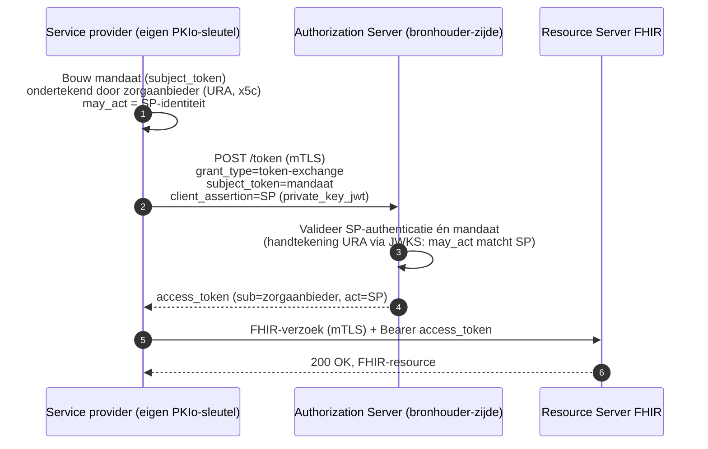
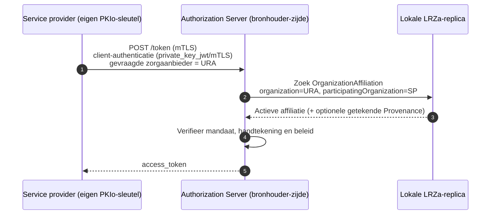
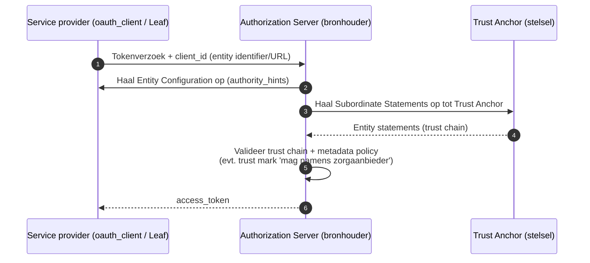

### Inleiding

Deze pagina analyseert hoe binnen de FAPI-conforme OAuth-flow uit [Authentication](authentication.html) kan worden aangetoond dat een **IT-service provider (SP)** — bijvoorbeeld een SaaS-leverancier of EPD-aanbieder — namens een **zorgaanbieder** handelt. De pagina is een technische verkenning (neutrale vergelijking) en schrijft nog geen keuze voor.

In de basisopzet van [Authentication](authentication.html) authenticeert de opvragende organisatie zich met een `private_key_jwt` die is ondertekend met het UZI-certificaat van de zorgaanbieder (URA). Daarmee wordt de *zorgaanbieder* feitelijk als OAuth-client gepresenteerd. In de praktijk bedient één SP echter **meerdere** zorgaanbieders en moet de SP:

- **niet** kunnen beschikken over de private sleutel van het vertrouwde certificaat met URA-nummer van de zorgaanbieder;
- een **eigen technische identiteit** hebben (FAPI vereist een *confidential client*; NEN 7513 vereist herleidbaarheid naar het uitvoerende systeem);
- aantoonbaar **geautoriseerd** zijn om namens een specifieke zorgaanbieder (URA) te handelen.

Tegelijk moet de organisatie-identiteit van de zorgaanbieder vaststelbaar blijven voor het autorisatiebesluit van de bron en voor de eis dat gegevens uitsluitend bij de vastgestelde zorgaanbieder terechtkomen.

> Deze pagina bouwt voort op de reacties op de memo [*Harmonisatie van authenticatie en autorisatie*](./authenticatie-en-autorisatie-eOverdracht-BgZ-vMT-DICIO-20260818.html) en werkt het "namens"-vraagstuk (mandatering) verder uit.

### Uitgangspunten uit de basisopzet

De volgende uitgangspunten uit [Authentication](authentication.html) blijven van kracht en begrenzen de oplossingsruimte:

- **OAuth 2.0 met FAPI 2.0** als basis, met de `client_credentials`-grant (systeem-tot-systeem, geen interactieve gebruiker in de uitwisseling).
- **Asymmetrische client-authenticatie** (`private_key_jwt` of mTLS); geen gedeelde geheimen.
- **Scheiding van transport- en applicatievertrouwen**: de transportlaag is met mTLS beveiligd, maar de organisatie-authenticatie wordt op berichtniveau geborgd.
- **Sender-constrained** access tokens (`DPoP` of mTLS).
- **URA** als stelselbrede organisatie-identiteit uit het UZI-register.

> **Aanname (UZI-servercertificaat).** We nemen expliciet aan dat elke zorgaanbieder een UZI-servercertificaat heeft of kan aanvragen. Het aanschaffen en beheren van *meerdere* certificaten — bijvoorbeeld één per leverancier — is echter kostbaar en beheerintensief. Oplossingen waarin de zorgaanbieder met **één** URA-certificaat volstaat, ongeacht het aantal leveranciers of tussenliggende systemen, hebben op dit punt een voordeel. In SaaS-situaties is het bovendien gangbaar dat de zorgaanbieder de leverancier **machtigt** om het UZI-servercertificaat namens haar aan te vragen en te beheren; de private sleutel staat dan op de infrastructuur van de leverancier, terwijl de zorgaanbieder juridisch de abonnee (verantwoordelijke) blijft.

### Evaluatiecriteria

De oplossingen worden beoordeeld op vier eigenschappen:

| Criterium | Toelichting |
|---|---|
| **Beveiliging** | Moet de SP over de URA-privésleutel beschikken? Is er een aparte, cryptografisch verifieerbare systeemidentiteit (NEN 7513)? Zijn integriteit/authenticiteit van het mandaat geborgd? Is het mandaat intrekbaar zonder het URA-certificaat in te trekken? Sluit de oplossing aan bij bestaande standaarden (o.a. "token is opaque to the client")? |
| **Implementatie-inspanning** | Hoeveel maatwerk (niet-standaard code) is nodig? Aanpassingen aan gateways/authorization servers? Welke certificaten moeten organisaties aanschaffen (URA per zorgaanbieder, PKIoverheid voor de SP)? Wordt het door standaard software ondersteund? |
| **Duurzaamheid / stabiliteit** | Zijn er *single points of failure* (centrale authorization server, live directory-lookups, JWKS-endpoints, status-diensten)? Is het mandaat offline/onafhankelijk verifieerbaar? Langlevend versus per-transactie? Robuust bij sleutel-/certificaatrotatie? |
| **Performance voor datagebruikers** | Hoeveel handtekeningen, JWKS-lookups, OCSP/CRL-checks of directory-lookups zijn per transactie nodig? Is het resultaat cachebaar (langlevend mandaat of lokale replica) of moet per verzoek opnieuw worden ondertekend/opgevraagd? |

De scores in de [samenvattende matrix](#samenvattende-vergelijking) zijn kwalitatief (**Hoog** / **Midden** / **Laag**), waarbij "Hoog" telkens *gunstig* betekent (hoge beveiliging, lage inspanning, hoge duurzaamheid, hoge performance).

### Oplossingen

#### O1 — Directe authenticatie met het URA-certificaat van de zorgaanbieder (basisopzet)

De opvragende kant gebruikt het UZI-certificaat (URA) van de zorgaanbieder zelf. Dit kent twee varianten die in de kern hetzelfde sleutelbezit vragen:

- **(a) Ondertekening op berichtniveau** (de opzet uit de memo): het `client_assertion`-JWT en het access token worden ondertekend met de URA-sleutel.
- **(b) mTLS/clientauthenticatie per zorgaanbieder**: de SP houdt per zorgaanbieder een apart URA-clientcertificaat en authenticeert zich telkens *als* die zorgaanbieder.

In beide varianten moet de opvragende kant over de URA-sleutel beschikken. Dat kan doordat de zorgaanbieder zelf een ondertekendienst draait, of — in SaaS-situaties gangbaar — doordat de zorgaanbieder de leverancier **machtigt** om het certificaat namens haar aan te vragen en te beheren, waarbij de private sleutel op de infrastructuur van de leverancier staat (de zorgaanbieder blijft juridisch de abonnee).

- **Beveiliging — Laag.** Door de SP ondertekende of aangeboden verklaringen zijn cryptografisch niet te onderscheiden van die van de zorgaanbieder zelf; er is geen aparte, herleidbare systeemidentiteit (spanning met NEN 7513). Variant (a) ondertekent access tokens per zorgaanbieder, wat afwijkt van gangbaar OAuth-gebruik (het token is normaliter *opaque* voor de client). Naarmate één leverancier meer zorgaanbieders bedient, stapelt het bezit van URA-sleutels van derden zich op — precies wat leveranciers onwenselijk noemen.
- **Implementatie-inspanning — Laag (losse koppeling) / Hoog (bij opschaling).** Voor één koppeling eenvoudig, maar elke zorgaanbieder heeft een URA-certificaat nodig en een zorgaanbieder met meerdere leveranciers mogelijk meerdere (kostbare) certificaten; variant (a) vergt daarnaast niet-standaard sleutelkeuze en client-side tokenvalidatie.
- **Duurzaamheid — Laag/Midden.** Sleutel- en certificaatbeheer verspreid over veel partijen; certificaatrotatie of -intrekking raakt alle betrokken koppelingen tegelijk.
- **Performance — Midden.** Ondertekening of clientauthenticatie per tokenverzoek; geen extra lookups.

Deze oplossing is de referentie en weerspiegelt voor losse SaaS-koppelingen de **huidige praktijk**, maar wordt door de reviewers **afgeraden bij opschaling** naar meerdere zorgaanbieders, leveranciers of tussenpartijen (zie [Analyse van reviewerreacties](#analyse-van-reviewerreacties)). De overige oplossingen adresseren de bezwaren ertegen.

#### O2 — Ondertekend mandaat per tokenverzoek (Token Exchange / JWT-bearer)

De zorgaanbieder ondertekent een **langlevend mandaat** (een JWT met `x5c`-header en het URA-certificaat) dat de eigen sleutel/identiteit van de SP aanwijst. De SP authenticeert zich met zijn **eigen** PKIoverheid-sleutel (`private_key_jwt` of mTLS) en biedt het mandaat aan bij het tokenverzoek. Twee gestandaardiseerde dragers:

- **OAuth 2.0 Token Exchange ([RFC 8693](https://www.rfc-editor.org/rfc/rfc8693))**: het door de zorgaanbieder ondertekende mandaat is het `subject_token` (namens wie), de SP is de `actor_token` (handelende partij). Het mandaat bevat een `may_act`-claim die de SP-identiteit als geautoriseerde actor benoemt; het uitgegeven token draagt een `act`-claim (die desgewenst een delegatieketen kan uitdrukken).
- **JWT-bearer autorisatie-grant ([RFC 7523](https://www.rfc-editor.org/rfc/rfc7523))**: het mandaat wordt als `grant_type=urn:ietf:params:oauth:grant-type:jwt-bearer` aangeboden.

Intrekking kan zonder het URA-certificaat in te trekken, via een korte geldigheidsduur of een statusmechanisme (zie [Bouwstenen](#bouwstenen)).

- **Beveiliging — Hoog.** De SP gebruikt een eigen sleutel; de zorgaanbieder houdt de URA-sleutel in eigen beheer. Het mandaat is cryptografisch verifieerbaar en het uitvoerende systeem is als aparte actor herleidbaar (`act`). Intrekbaar zonder URA-certificaatintrekking.
- **Implementatie-inspanning — Midden.** `may_act`/`act` en Token Exchange worden door diverse autorisatiesoftware ondersteund, maar het uitgeven en valideren van mandaten vraagt inrichting. De SP heeft een (PKIoverheid-)certificaat nodig, de zorgaanbieder een URA-certificaat.
- **Duurzaamheid — Midden/Hoog.** Het mandaat is langlevend en onafhankelijk verifieerbaar (offline, via het JWKS van de zorgaanbieder). Een robuust intrekkingsmechanisme is nog in ontwikkeling (zie B4).
- **Performance — Midden.** Mandaatvalidatie plus JWKS-lookup per (nieuw) tokenverzoek; het mandaat zelf is cachebaar.

#### O3 — Centraal opgeslagen en gedistribueerd OrganizationAffiliation-mandaat (LRZa Directory)

Het "namens"-verband wordt vastgelegd als een `OrganizationAffiliation`-resource in de LRZa Directory (zoals in [Care Services Directory](care-services.html)) en via replicatie (ITI-90-NL/ITI-91-NL) verspreid naar lokale replica's. De zorgaanbieder (`organization`) autoriseert de SP (`participatingOrganization`) met een autorisatietype (`code`). De authorization server aan bronhouder-zijde raadpleegt **altijd** zijn **lokale replica** — centrale live lookups op de LRZa Directory zijn uitgesloten, want de Directory heeft geen operationele rol in de data-uitwisseling (zie [Care Services Directory](care-services.html)). Gegeven de geauthenticeerde SP-identiteit controleert de server of er een actieve affiliatie met de geclaimde zorgaanbieder (URA) bestaat voor het relevante autorisatietype. Optioneel draagt de affiliatie een ondertekende `Provenance` (zie [Resource signing](signing.html)), zodat het mandaat onafhankelijk verifieerbaar is zonder de LRZa op zijn woord te vertrouwen.

**Aandachtspunten bij deze uitwerking:**

- De huidige autorisatietypes in [`NlGfAuthorizationTypeCS`](CodeSystem-nl-gf-authorization-type-cs.html) (`lrza-careprovider-admin`, `lrza-endpoint-admin`) gaan over het **beheren van adresseringsdata** in de Directory, niet over data-uitwisseling. Voor deze use case is een **nieuw autorisatietype** nodig (bijvoorbeeld voor "namens deze zorgaanbieder BgZ/eOverdracht opvragen"), eventueel met een gekoppelde SMART-on-FHIR-scope (zoals het bestaande `smart-on-fhir-scope`-patroon in dat CodeSystem).
- De `participatingOrganization` wordt nu via een KVK-nummer geïdentificeerd. Om het mandaat aan de **OAuth-clientidentiteit** van de SP te koppelen, moet de identiteit (bijvoorbeeld `client_id`, `jwks_uri` of certificaatkenmerk) aan de affiliatie worden gebonden — via een extensie of via de koppeling die [Dynamic Client Registration](#b1--dynamic-client-registration-rfc-7591--udap) legt.

Overwegingen:

- **Beveiliging — Midden/Hoog.** Aparte SP-identiteit; het mandaat is centraal beheerd en (met `Provenance`) onafhankelijk verifieerbaar. De bron vertrouwt op de integriteit van de replicatieketen; ondertekening dekt dat af.
- **Implementatie-inspanning — Midden/Hoog.** Vereist een nieuw autorisatietype en een identiteitsbinding, plus replica-infrastructuur — maar hergebruikt de bestaande GF Adressering en de reeds aanwezige signing-aanpak.
- **Duurzaamheid — Hoog.** De bevraging gebruikt altijd de lokale replica; live centrale lookups op de LRZa Directory zijn uitgesloten (zie [Care Services Directory](care-services.html)), dus er is geen centrale *single point of failure*. Het mandaat is niet per-transactie maar vooraf vastgelegd.
- **Performance — Hoog.** Lokale replica-lookup, geen ondertekening of JWKS-lookup per tokenverzoek.

#### O4 — OpenID Federation (trust chains)

[OpenID Federation 1.0](https://openid.net/specs/openid-federation-1_0.html) bouwt een federatief vertrouwensmodel met **entity statements** (ondertekende JWT's), een **trust anchor** (het stelsel) en **trust chains** die via `authority_hints` en subordinate statements naar de trust anchor leiden. De SP publiceert een *entity configuration*; de authorization server (bronhouder-zijde) lost de trust chain op en past *metadata policies* toe. De relatie "SP mag namens zorgaanbieder handelen" kan worden uitgedrukt via de hiërarchie (de zorgaanbieder als *superior* van de SP) of via een **trust mark** (een ondertekende conformiteits- of afspraakverklaring; de specificatie noemt expliciet het attesteren van een overeenkomst tussen entiteiten). Dit model is FAPI-compatibel en ondersteunt automatische/expliciete clientregistratie.

- **Beveiliging — Hoog.** Eigen SP-sleutels; vertrouwen wordt cryptografisch via de trust chain vastgesteld en is niet afhankelijk van Web PKI. Trust marks kunnen relaties/afspraken attesteren.
- **Implementatie-inspanning — Laag/Midden voor de datagebruiker (veel off-the-shelf software), maar Hoog om als stelsel op te zetten** (trust anchor, intermediates, entity endpoints, beleid). Dit is een stelselbrede investering.
- **Duurzaamheid — Hoog.** Ontworpen voor gedistribueerde, meerlaagse federaties; trust chains zijn cachebaar en er is een historical-keys-mechanisme voor sleutelrotatie.
- **Performance — Midden/Hoog.** Trust chains en verificatieresultaten zijn cachebaar; bij een koude cache zijn meerdere fetches nodig.

#### O5 — Verifiable Credential als mandaat (opkomend)

De zorgaanbieder geeft de SP een **verifiable credential** als mandaat uit (bijvoorbeeld een [SD-JWT VC](https://datatracker.ietf.org/doc/draft-ietf-oauth-sd-jwt-vc/), gepresenteerd via OpenID for Verifiable Presentations). Dit sluit aan op de "business wallet"-richting die enkele reviewers noemen: het mandaat kan later door een wallet worden ondertekend in plaats van door een vertrouwd certificaat met URA-nummer. Selectieve openbaarmaking maakt dataminimalisatie mogelijk.

- **Beveiliging — Hoog (potentieel).** Eigen SP-identiteit, cryptografisch verifieerbaar mandaat, dataminimalisatie; intrekking via statuslijst.
- **Implementatie-inspanning — Hoog.** Wallet-/VC-infrastructuur is nog niet gangbaar in de zorg; standaarden zijn deels nog in ontwikkeling.
- **Duurzaamheid — Midden/Hoog.** Ontworpen voor issuer–holder–verifier zonder centrale runtime-afhankelijkheid, maar het ecosysteem is nog jong.
- **Performance — Hoog.** Presentatie en verificatie zonder per-transactie centrale lookup; statuscontrole cachebaar.

Deze oplossing is **toekomstgericht** en hier vooral opgenomen als groeipad.

### Aspect: tussenliggende uitwisselsystemen (knooppunten)

In sommige uitwisselingen zit tussen de opvragende en de bronhoudende partij nog een extra **uitwisselsysteem** (een knooppunt of intermediair), dat vandaag doorgaans alleen een **eigen** UZI-servercertificaat heeft. Zo'n partij heeft impact op de mandatering:

- **Transportidentiteit is niet de zorgaanbieder.** Het mTLS-certificaat van het knooppunt identificeert het knooppunt (of de leverancier), niet de zorgaanbieder. Dit onderstreept de scheiding van transport- en applicatievertrouwen: de organisatie-identiteit (URA) moet op berichtniveau meereizen en mag niet uit het transportcertificaat worden afgeleid.
- **Geen URA-sleutels op knooppunten.** Het is onwenselijk om de private URA-sleutel van een zorgaanbieder op een knooppunt te plaatsen (ook in de consultatie benoemd). Dit pleit tegen **O1**: hoe meer tussenpartijen, hoe onhoudbaarder verspreid sleutelbezit wordt.
- **Mandaatgebaseerde oplossingen schalen beter.** Bij **O2**/**O3**/**O4** handelt elk systeem met zijn eigen identiteit, terwijl het door de zorgaanbieder ondertekende mandaat los meereist (O2) of centraal vindbaar is (O3). De `act`-claim van Token Exchange (O2) kan een **keten** van tussenpartijen expliciet maken (geneste actors), wat de herleidbaarheid (NEN 7513) ten goede komt.
- **Extra schakel is extra afhankelijkheid.** Elke tussenpartij is zelf een online schakel die beschikbaar en te vertrouwen moet zijn; dit raakt de **duurzaamheid**, ongeacht de gekozen oplossing. De mandaatverificatie zelf blijft offline — O3 gebruikt de lokale replica, O2/O5 het langlevende mandaat, dus zonder extra centrale lookup. Overige online afhankelijkheden, zoals status-/intrekkingsdiensten (B4), OCSP/CRL of een koude trust-chain-fetch (O4), tellen daar bovenop.

### Bouwstenen

De volgende gestandaardiseerde bouwstenen zijn geen zelfstandige "namens"-bewijzen, maar zijn **combineerbaar** met de oplossingen hierboven (met name O2 en O3).

#### B1 — Dynamic Client Registration (RFC 7591 / UDAP)

Met [OAuth 2.0 Dynamic Client Registration (RFC 7591)](https://www.rfc-editor.org/rfc/rfc7591), geprofileerd volgens [UDAP](https://www.udap.org/), registreert de SP zichzelf trust-based als OAuth-client op basis van zijn X.509-certificaat (zie ook de sectie *Dynamic Client Registration* in [Authentication](authentication.html)). Dit vestigt de **technische SP-identiteit** en voldoet aan de FAPI-eis van een *confidential client*. DCR drukt op zichzelf géén "namens"-relatie uit en wordt daarom gecombineerd met O2 (mandaat) of O3 (directory-affiliatie).

#### B2 — Protected Resource Metadata (RFC 9728)

Met [RFC 9728](https://www.rfc-editor.org/rfc/rfc9728) publiceert de resource server metadata die het resource-endpoint aan de bijbehorende authorization server(s) koppelt. Zo stelt de raadpleger het endpoint/AS-vertrouwen vóór tokenuitgifte vast, in plaats van via een ondertekend access token. Dit adresseert het bezwaar dat vertrouwen "op de verkeerde protocollaag" wordt opgelost.

#### B3 — Attribuutdrager: RAR, UDAP B2B of IHE IUA

Naast de identiteit moeten het **doel** (`purpose_of_use`) en eventuele context worden meegedragen. Opties:

- **Rich Authorization Requests ([RFC 9396](https://www.rfc-editor.org/rfc/rfc9396))** — generiek en uitbreidbaar; de keuze in [Authentication](authentication.html).
- **UDAP B2B Authorization Extension** (`hl7-b2b`) — draagt in de `client_credentials`-flow onder meer `organization_id` (verplicht, URI), `organization_name`, `subject_*` en `purpose_of_use` (verplicht) mee in het `client_assertion`-JWT.
- **IHE IUA** — JWT-extensie met `purpose_of_use`, gangbaar in IHE-omgevingen.

Onder FAPI 2.0 worden deze bij voorkeur via **Pushed Authorization Requests ([RFC 9126](https://www.rfc-editor.org/rfc/rfc9126))** aangeboden.

#### B4 — Intrekking van het mandaat

Om een mandaat in te trekken zonder het onderliggende URA-certificaat in te trekken:

- **Token Status List ([draft-ietf-oauth-status-list](https://datatracker.ietf.org/doc/draft-ietf-oauth-status-list/))** — een schaalbare, privacyvriendelijke statuslijst (bit-array) voor JWT/SD-JWT-mandaten, met *herd privacy*. Nog een IETF-concept.
- **Korte geldigheidsduur** met periodieke heruitgifte.
- **OCSP/CRL** op certificaatniveau (grofmaziger; trekt het hele certificaat in).

### Samenvattende vergelijking

De volgende matrix vat de kwalitatieve beoordeling samen. **Hoog** betekent telkens gunstig (hoge beveiliging, lage inspanning, hoge duurzaamheid, hoge performance). De oplossingen O2, O3, O4 en O5 zijn combineerbaar met de bouwstenen B1–B4.

| Oplossing | Beveiliging | Implementatie-inspanning | Duurzaamheid | Performance |
|---|---|---|---|---|
| **O1** Directe URA-authenticatie van de zorgaanbieder *(basisopzet; huidige SaaS-praktijk, af te raden bij opschaling)* | Laag | Laag (losse koppeling) / Hoog (opschaling) | Laag/Midden | Midden |
| **O2** Ondertekend mandaat per verzoek (RFC 8693 / RFC 7523) | Hoog | Midden | Midden/Hoog | Midden |
| **O3** Centraal `OrganizationAffiliation`-mandaat (LRZa) | Midden/Hoog | Midden/Hoog | Hoog | Hoog |
| **O4** OpenID Federation (trust chains) | Hoog | Hoog (stelsel) / Laag (gebruiker) | Hoog | Midden/Hoog |
| **O5** Verifiable Credential-mandaat *(opkomend)* | Hoog | Hoog | Midden/Hoog | Hoog |

> "Implementatie-inspanning: Hoog (stelsel) / Laag (gebruiker)" bij O4 betekent dat de eenmalige inrichting van de federatie omvangrijk is, terwijl een individuele datagebruiker daarna met gangbare software kan aansluiten.

### Analyse van reviewerreacties

Onderstaande punten uit de consultatie op de memo raken direct het "namens"-vraagstuk. Per reviewer staat het waargenomen probleem en de voorgestelde oplossingsrichting, met verwijzing naar de oplossingen hierboven.

#### Silizo (Ernst Lawende)

1. **Leveranciers mogen geen toegang krijgen tot de private key van UZI-servercertificaten.** Voorstel: het systeem gebruikt eigen sleutels; de relatie met de zorgaanbieder wordt vastgelegd in **langlevende, door de zorgaanbieder ondertekende mandaten** (JWT met `x5c` en `may_act`), met een intrekkingsmogelijkheid los van het certificaat. → **O2** (+ **B4**).
2. **Het uitvoerende systeem is niet als aparte technische actor herkenbaar** (spanning met NEN 7513). Voorstel: modelleer het systeem als aparte OAuth-client. → **B1** in combinatie met **O2**/**O3**.
3. **Ondertekenen van access tokens per zorgaanbieder wijkt af van de standaard** ("the token is opaque to the Authorization Client"). Voorstel: behandel het access token als *opaque*; laat AS en RS onderling bepalen hoe het token wordt uitgegeven en gevalideerd. → argument **tegen O1**.
4. **Endpoint-/AS-vertrouwen wordt op de verkeerde protocollaag opgelost.** Voorstel: een langlevend mandaat plus **RFC 9728** om resource-endpoint en authorization server te koppelen. → **O2** + **B2**.
5. **Herkenning van confidential clients is niet uitgewerkt.** Voorstel: een geautomatiseerd registratie-/federatiemodel (**RFC 7591**). → **B1** (en **O4**).
6. **De onderbouwing van de client-credentials-keuze klopt niet** (FAPI verplicht die grant niet). → raakt de motivatie in [Authentication](authentication.html); **O2** gebruikt bovendien Token Exchange als aanvullende grant.
7. **Geschiktheid voor andere use cases is onvoldoende onderbouwd.** → raakt de (nog te publiceren) autorisatie-uitwerking en het RAR-object (**B3**).

#### ChipSoft (Vincent van der Berg)

- **Major — de bronhouder ondertekent het access token met een URA-certificaat.** Dit is niet houdbaar en niet standaard (token *opaque* voor de client; ondertekening hoort bij de authorization server, die de SP-rol is). Voorstel: een **ondertekend mandaat** (`may_act`), gekoppeld aan het (PKIoverheid-)certificaat van de SP en aangeboden via **Token Exchange (RFC 8693)**; verhelder de rollen van authorization server en OAuth-client. → **O2** (argument **tegen O1**).
- **Minor — geen voorafgaande clientregistratie.** Dit past slecht bij FAPI 2.0 (bekende confidential client). Voorstel: **Dynamic Client Registration (RFC 7591)**, eventueel met een allowlist. → **B1**.
- **Correctie — mTLS-vertrouwen** moet ook door de leverancier (SP) met een (PKIoverheid-)certificaat geregeld kunnen worden, niet met een URA-certificaat. → raakt het transport-uitgangspunt in [Authentication](authentication.html).
- **Business wallet.** De reviewer wijst erop dat mandaten in de toekomst door een wallet ondertekend kunnen worden. → **O5**.

Beide reviewers convergeren op hetzelfde beeld: de SP handelt met een **eigen** clientidentiteit, en het "namens" wordt geborgd via een **apart, door de zorgaanbieder ondertekend mandaat** (O2), aangevuld met clientregistratie (B1). De centraal gedistribueerde `OrganizationAffiliation` uit **O3** is in feite een *vooraf vastgelegde, gedistribueerde* variant van datzelfde ondertekende mandaat: in plaats van het mandaat per tokenverzoek mee te sturen, wordt het één keer vastgelegd en via de Directory verspreid.

### Afwegingen en observaties

Deze pagina wijst geen voorkeur aan. Enkele neutrale observaties:

- De oplossingen verschillen vooral in **waar** het mandaat leeft: per-transactie meegestuurd (**O2**, **O5**), centraal vastgelegd en gedistribueerd (**O3**), of impliciet in een federatieve hiërarchie (**O4**). Dat is de belangrijkste ontwerpkeuze en bepaalt grotendeels de performance- en duurzaamheidsprofielen.
- **O2** en **O3** zijn geen tegenpolen maar complementair: O2 is dynamisch en fijnmazig, O3 is vooraf vastgelegd en cachebaar. Een combinatie (O3 voor de langlevende "mag-namens"-relatie, O2 voor transactie-specifieke context) is denkbaar.
- **B1 (DCR)** is in vrijwel alle scenario's nodig om de SP als *confidential client* te laten herkennen; het is eerder een randvoorwaarde dan een alternatief.
- **O1** weerspiegelt voor losse SaaS-koppelingen de huidige praktijk (leverancier gemachtigd voor het UZI-certificaat), maar wordt door de reviewers afgeraden zodra één leverancier meerdere zorgaanbieders bedient of er tussenpartijen bij komen; het is hier vooral als referentie opgenomen.
- Mandaatgebaseerde oplossingen (**O2**–**O5**) vragen van de zorgaanbieder slechts **één** URA-certificaat, ongeacht het aantal leveranciers; dat beperkt de certificaatkosten ten opzichte van **O1**.
- **Tussenliggende uitwisselsystemen** (knooppunten) versterken de argumenten voor mandaatgebaseerde oplossingen en pleiten tegen het verspreiden van URA-sleutels; zie het aspect *Tussenliggende uitwisselsystemen* hierboven.
- De keuze voor een **attribuutdrager** (B3: RAR, UDAP B2B of IUA) en een **intrekkingsmechanisme** (B4) staat grotendeels los van de keuze voor O2/O3/O4 en kan afzonderlijk worden gemaakt.
